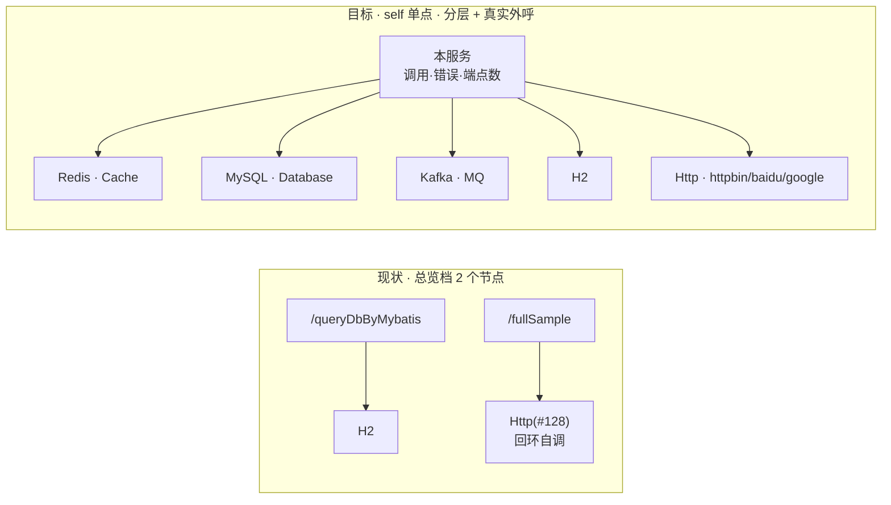

# 依赖拓扑演示面：总览档 self 单点 + 中间件/外呼依赖面

Status: ready-for-agent

前置：[`../dependency-topology/spec.md`](../dependency-topology/spec.md)（已交付）。本 spec 只做**演示面**改造：
**插件与读口零改动**，改的是页面左列、演示应用的造数面、compose 编排与文档。

## Problem Statement

依赖拓扑页机制已通（189 单测 + 三场景 verify 全绿），但拿来看**有两处对不上**：

**一、总览档左列是一列入口端点，而不是"我们自己"。**

| 位置 | 说法 |
| --- | --- |
| `dependency-topology/spec.md:15` | 「以自身服务为**唯一中心节点**」 |
| 同文件 L21 / L159 | 「左列 = 入口端点，**复用已有 Trace 指标，零新代码**」 |

spec 自相矛盾，实现取了后者。左列于是变成 8~15 个 `/api/...` 端点名，**汇报图的主角是接口目录而不是依赖结构**——
「我这个单体伸出去几只手、每只手什么健康度」这个问题仍然要数端点才答得上来。

**二、演示应用的依赖面只有 2 个组件，总览档"能证明机制"但"撑不起展示"。**

现有依赖只有进程内嵌 H2 与回环自调的 Hutool HTTP（`componentId=128`，不在组件库里）。总览档因此只有 2~3 个节点，
且**外呼全是自己调自己**——给领导看时"外部依赖"这个词没有说服力。

## Solution

| 改动 | 性质 | 成本 |
| --- | --- | --- |
| 总览档左列 → **单一 self 节点**（带总量与端点数） | 纯前端（`topology.html`） | 一处渲染分支 + 文案 |
| 端点维度下沉到**明细档与边列表** | 不动表格 | 0 |
| compose 加 **Redis / MySQL / Kafka**，收在 `profiles: ["deps"]` | 编排 | 三个 service |
| demo-app 新增 `DepsDemoController`（含白名单外呼），**全调用显式超时** | 造数面 | 一个 controller |
| 探针 + verify 断言 + 文档收口 | 证据与口径 | 见票 04~06 |

**不碰插件、不碰读口契约、不碰边模型。**

## User Stories

### 总览档（汇报视角）

1. 作为汇报者，我想总览图左侧**只有一个**代表本服务的节点，以便一眼回答"我伸出去几只手、每只手什么健康度"。
2. 作为汇报者，我想 self 节点上直接印出**窗口内总调用 / 总错误 / 覆盖端点数**，以便不点开任何东西就能报出规模。
3. 作为汇报者，我想总览图**布局与坐标不变**（沿用固定两列），以便两次截图可直接对比。
4. 作为开发者，我想端点维度**不丢**（明细档左列 + 边列表第一列仍在），以便从 self 单点下钻到具体接口。
5. 作为开发者，我想点 self 节点时得到**明确提示**而不是无反应或跳到某个任意的端点。

### 依赖面（演示与取证）

6. 作为汇报者，我想依赖图覆盖 **Cache / Database / MQ** 三层，以便展示"伸出去的手"是分层的、不是清一色 HTTP。
7. 作为汇报者，我想看到**真实站点**外呼（httpbin / baidu / google），以便把"回环自调"与"真外网出口"区分开。
8. 作为开发者，我想**一条命令**起齐中间件（`docker compose --profile deps up`），以便复现整张图。
9. 作为开发者，我想**中间件不在时端点照样被调用**，以便本机没有 Docker 也能验证造数面本身（不挂住、白名单、超时）。
    > ⚠️ **实测修正（见 `docs/notes/2026-10-01-deps-demo-topology-probe.md`）**：「照样产出依赖**边**」只对
    > **连接不需要成功**的通道成立（Kafka `send`、Hutool 外呼 —— 它们的拦截点在调用发出之后）。
    > **Jedis / JDBC 连不上时图上根本没有那个组件节点**：连接建立发生在被观测的调用之前，不产生出口 span。
    > 所以缺席有两种含义，必须分开读：**有节点 + 红边 = 连不上**；**没有节点 = 连接都没建起来**。
10. 作为开发者，我想造数端点**永不挂住**（显式超时 + 异常吞掉），以便压测（16 线程）与页面 5s 轮询都不被拖死。
11. 作为开发者，我想外呼端点**只接受白名单枚举**，以便演示端点不变成任意 URL 的出口（SSRF）。
12. 作为开发者，我想**慢与错可主动制造**（`sleepMs` / 故意打不通的站点），以便验证分位与四档着色真的在工作，而不是只看到一片 0ms 绿。

### 口径诚实

13. 作为读者，我想页面写清"总览档左列是入口端点的聚合"，以便不误以为本服务只有一个接口。
14. 作为读者，我想页面写清"外呼域名不各自成节点（只到组件类型）"，以便不把三个站点误读成三个依赖。
15. 作为读者，我想页面写清"**连接都没建起来的依赖不出现在图上**"，以便把「没有节点」与「有节点但红边」读成两件事。

## Implementation Decisions

### 页面：self 单节点

| 位置（`topology.html`） | 现状 | 改成 |
| --- | --- | --- |
| `renderChart` 建左节点 | 按 `e.endpoint` 建 N 个 | `summary` 档改建一个 `s:self`；明细档不变 |
| 左节点坐标 | `y = 60 + i*420/(rows-1)`（单节点贴顶） | self 节点垂直居中；`symbolSize` 40 |
| `links[].source` | `"e:" + e.endpoint` | summary 档 `"s:self"`；`pairSeq` 的 pair 键同步改，否则同组件多端点的边会叠成一条 |
| self 节点 label | — | 两行：`本服务` + `调用 N · 错误 M · 端点 K` |
| self tooltip | — | 加：窗口内端点清单、最慢的那个依赖 |
| hint / legend / categories | 「左=入口端点」「入口端点」 | summary 档 → 「左=本服务（入口端点已聚合）」「本服务」 |
| 点击 handler | 点端点节点跳慢查询页 | self 节点**不跳转**，提示去边列表看端点明细 |
| caveats | 无 | 加第 3 条口径（US 13/14/15） |
| `renderTable` | 按端点明细 | **不动** |

- **字段来源**：全部取自**窗口内已跨桶合并后的边集**——总调用 = Σ`requestCount`、总错误 = Σ`errorCount`、端点数 = distinct `endpoint`。**不新增读口字段**。
- **服务名不写死**：读口不给 `service_name`，verify 场景服务名是 `demo-app-verify`。label 用「本服务」；要带服务名需给读口加字段，本期不做。

### 中间件与造数端点

`pom.xml` 加 3 个依赖（**agent 侧插件已就位，宿主组件库已收录**，故组件名自动翻译、零改翻译层）：

| 依赖 | 命中的 agent 插件 | 组件库 |
| --- | --- | --- |
| `spring-boot-starter-data-redis`（Lettuce） | `apm-lettuce-5.x-plugin` | `Redis` |
| `mysql-connector-j` | `apm-mysql-8.x-plugin` | `MySQL` |
| `org.apache.kafka:kafka-clients`（**不用** spring-kafka） | `apm-kafka-plugin` | `Kafka` |

配置**独立 `deps.*` 前缀 + 环境变量兜底**（`${DEPS_REDIS_HOST:localhost}` 等）：**不碰 `spring.datasource`**（会让 Boot 改用 MySQL 顶掉 H2 演示库，NOTES 已记 H2 的既有坑），MySQL / Kafka 手工建连接。

| 端点 | 调用 | 组件节点 | 备注 |
| --- | --- | --- | --- |
| `/api/deps-demo/redis?op=get\|set\|del` | Lettuce | `Redis` | 三种 op → 明细档三个节点 |
| `/api/deps-demo/mysql?sleepMs=0` | `SELECT 1` / `SELECT SLEEP(?)` | `MySQL` | 不建表；`sleepMs` 上限 3000 |
| `/api/deps-demo/kafka?op=produce\|consume` | kafka-clients | `Kafka` | topic 用 Admin 自动建；consume 带 poll 超时 |
| `/api/deps-demo/http?site=httpbin\|baidu\|google` | Hutool（已有 override 插件，面更宽） | `Http(#128)` | **白名单枚举**，不接受任意 URL |

### 超时总则（硬要求）

所有造数端点的出网调用**必须显式设值**，不得依赖驱动默认（默认多为无限或几十秒，会把 16 线程压测拖成串行等待、也会让页面 5s 轮询读到半截数据）。

| 通道 | 参数 | 取值 |
| --- | --- | --- |
| Redis | 连接超时 + 命令超时 | 各 1s |
| MySQL | JDBC URL `connectTimeout` / `socketTimeout` | 2000ms / 3000ms |
| Kafka | `request.timeout.ms` / `delivery.timeout.ms` / `max.block.ms` | 3000 / 5000 / 3000 |
| Hutool 外呼 | `HttpRequest.timeout()`（一个值覆盖连接与读） | 3000ms |

- **端点兜底**：整个调用包 `try/catch`，异常转成响应体字段返回 → **Entry 不标错、边标错**，图上表现为"self 的边红、端点不红"，正好演示边级错误口径，也不刷 Trace 告警。
- 探针（票 04）须**记录每条超时的实际生效值**（Boot 属性名随版本变，认不认要实测），写进笔记。

### compose 编排

- 三个 service 收在 `profiles: ["deps"]`——沿用仓库既有做法（`stress` 就这么收的）：默认 `up` 保持轻量不变，看拓扑用 `--profile deps`。
- `demo-app` 加 `environment: DEPS_REDIS_HOST: redis` 等（**不改 java command**，Spring 直接读环境变量）。
- 各给 `mem_limit`；MySQL 只 `SELECT 1`/`SLEEP`，**不建表、不挂 init sql**。
- **外网可达性取决于宿主网络**：baidu / google 不通就是红边——这是预期，不是故障（须写进文档）。

### 与既有决策的关系

- **不碰 ADR-03 / ADR-04**：不改编荷、不改表、不改写路径。
- **不扩边模型**：peer（对端地址）仍不进边键 → 外呼域名不各自成节点（US 14）。解锁条件已在 `2026-09-30-exit-span-runtime-probe.md` 记录（`db.instance` / `url` 标签现成），本期不启用。
- **修正既有 spec 的自相矛盾**：L21/L159 的"左列 = 入口端点"改为"总览档 self 单点、端点维度在明细档与边列表"（票 06）。

## Testing Decisions

### 主 seam = verify 场景断言（`verify/scenarios/logfile-reporter/checks.sh`）

**分层断言，让没有中间件的机器也能过：**

| 断言 | 前置 | 期望 |
| --- | --- | --- |
| 造数端点不挂住 | 无 | 每个 `/api/deps-demo/*` 在预算内返回 200（Kafka 10s，其余 5s），粗断言证明超时生效 |
| 组件识别 | 无 | 拓扑读口出现 **`h2-jdbc-driver`** 与 **`kafka-producer`** 的边，且组件名**不是** `component-N` 兜底 |
| 必测通道有边 | 无 | Kafka（`send` 不需要连接成功）与 Http 外呼一定有边 |
| 白名单 | 无 | 未知 `site` 被拒且立刻返回 |
| 绿边（可选） | 中间件在场 | `Redis` / `MySQL` / `kafka-producer` 边 `errorCount = 0` 且 `requestCount > 0`；`mysql?sleepMs=300` 的 `maxLatency >= 300` |
| 不回归 | 无 | 现有 Trace 指标与告警断言全绿 |

> ⚠️ **组件名按实测值断言，不按概念名**：组件库 `component-libraries.yml` 里 H2 的键是
> `h2-jdbc-driver`、Kafka 的是 `kafka-producer`（**不是** `H2` / `Kafka`）——写成概念名会永远红。
>
> ⚠️ **「无中间件 → 红边」对 Jedis/JDBC 不成立**（见 US 9 的修正与探针笔记）：必测的只有
> 「连接不需要成功也照样有边」的通道；Cache / Database 两层的有边与绿边属**可选**断言，
> 中间件不在场时跳过并说清原因。

### 单元 seam

**无新增单测**：插件零改动。回归只需跑既有 189 单测。

### 不测

- **不测 JS 渲染**（本仓无 JS 测试基建）：self 节点的信息量与布局由**浏览器实跑目测 + 截图**取证。
- **不测组件名翻译**：复用既有映射，宿主侧已有覆盖。

## Out of Scope

- **不把 peer 提进边键**：外呼域名不各自成节点（US 14 写进页面口径）。
- **不替换 H2**：MySQL 是新增并存（H2 的 schema.sql / h2 console / 校验脚本都依赖它）。
- **不把中间件默认起**：默认 `up` 仍不起 deps profile。
- **不做 ES / MongoDB / RocketMQ / spring-kafka**：每加一个就是一份镜像体积与内存。
- **不改插件、读口契约、边模型、聚合上限**。
- **不做任意 URL 外呼**、不做依赖边持久化 / 实例级 / 跨段（承接既有 spec 的 Out of Scope）。
- **不给 self 节点加下钻**（无单一 endpoint 可传）。

## Further Notes

- **探针先行**（票 04）：三个新组件的 `componentId` / `componentName` / `spanLayer` / 操作名归一化情况，以及 `kafka-clients` 版本是否落在 agent 插件支持范围内，**都按 9-30 那两篇的实跑取证方式落实**——上一轮就是探针推翻了"operationName 基数"与"实例身份"两处预设。
- **总览档节点数 = 组件类型数**，不是 host 数、也不是操作名数。故"丰富节点"只能靠新组件类型；外呼域名与操作名丰富的是**边**与**明细档**。
- **实测截图形态**（票 01/02 落地后）：总览档 = self 单点 + **4 个**右列节点
  （`h2-jdbc-driver` / `Http(#128)` / `HttpClient` 红 100% / `kafka-producer`），self 标签
  「调用 83 · 错误 12 · 端点 6」；明细档左 6 个入口端点、右「组件 + 出口操作名」
  （`H2/JDBC/PreparedStatement/execute` 与 `executeQuery` **是两个节点**——加操作名确实能加节点）。
  **未起中间件时 Redis / MySQL 不在图上**（连接都没建起来），这张图讲的是"分层 + 哪些还没接上"。
- 造数入口需同步四处：页面空态提示、`demo-app/README.md`、`verify/README-starter.md` 页面速查表、`NOTES-docker-stress.md`。