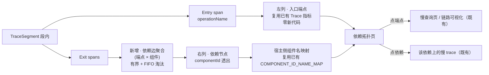

# 单体依赖拓扑图（self 为核心的调用依赖视图）

Status: ready-for-agent

## Problem Statement

本仓插件的排障能力已经很完整——**Trace 指标**（含最差分钟分位）、**极端值追溯**、**慢查询**、**逐段双源对照**——但它们**全部只按"入口端点"这一个维度组织**。结果是：开发者能回答"`/api/order/*` 这一分钟最坏有多坏"，却答不出第二个问题——**"它慢在哪个外部依赖上"**。

依赖信息其实**已经在数据里**，只是没人用：每个 `Exit` span 都带组件标识，而段内 Entry span 与 Exit span 天然同属一次调用。但当前插件**只聚合 Entry span**，`Exit` span 的耗时**从未被任何聚合器统计过**。于是"我调了数据库、调了哪个 HTTP、哪条路慢"这件事，在仪表盘上完全不可见——只能去翻单条 trace 的 span 树，而单条 trace 是抽样视角，看不出全局分布。

OAP 侧的对照：SkyWalking 的拓扑图由 ingest 期的 `RPCAnalysisListener` 遍历 span、构建 `ServiceRelation` 来源，再经 OAL 落成关系指标流，UI 读指标流作图。本仓是**单体自用**场景、不依赖独立 OAP，因此不需要也不建 `ServiceRelation` 骨架——只需要把这一个维度补上。

## Solution

新增一个**依赖拓扑视图**：以自身服务为唯一中心节点，向外画出"我调了哪些外部依赖"。

**两档视图**（同一页切换）：

| 档 | 右列节点 | 用途 |
| --- | --- | --- |
| **总览图** | 组件类型（`H2`、`HttpClient` …） | 节点少而稳定，可直接截图进汇报材料 |
| **明细图** | 组件类型 + `Exit.operationName` | 自诊定位到"哪条路径在慢" |

**左列零新代码**——入口端点与端点级指标已由现有 Trace 指标读口提供。本次**唯一新增的聚合是"依赖边"**，承载调用量、错误数、耗时分位与最大耗时。

**存储为纯内存有界结构**，与 ADR-04 的 H2 内存窗口语义一致（分钟~小时级、重启即失），**不新建任何持久层表**。先跑一段时间验证可行性与分位口径，再议持久化。

## User Stories

### 依赖发现

1. 作为单体应用的开发者，我想看到"我这一步在调哪些外部依赖"，以便知道这个进程到底伸出去多少只脚。
2. 作为单体应用的开发者，我想**一眼**看到依赖的数量与各自的调用量，以便判断依赖面是收敛还是发散。
3. 作为单体应用的开发者，我想看到每个依赖**是哪个组件类型**（数据库 / HTTP 客户端 / 缓存 / 消息队列 …），以便区分"我在调库"和"我在调外部接口"。
4. 作为单体应用的开发者，我想在**总览档**只看到组件类型，以便得到一张节点少、名字稳定、能直接进汇报材料的图。
5. 作为单体应用的开发者，我想切到**明细档**看到"组件类型 + 具体操作名"，以便定位到是哪条路径在慢。
6. 作为单体应用的开发者，我想知道这些依赖是**哪些入口端点**触发的，以便知道改哪个接口会影响哪个下游。
7. 作为单体应用的开发者，我想看到"某个依赖是被哪些端点调用的"这一反向关系，以便判断它是关键路径还是边缘调用。

### 排障闭环（主线）

8. 作为单体应用的开发者，我想看到**每条依赖边的调用量**，以便判断这条依赖是主干还是零星调用。
9. 作为单体应用的开发者，我想看到**每条依赖边的错误数与错误率**，以便第一时间发现"某个下游最近在报错"。
10. 作为单体应用的开发者，我想看到**每条依赖边的耗时分位**，以便回答"调这个依赖**通常**有多慢"（而非只看最坏那一次）。
11. 作为单体应用的开发者，我想看到**每条依赖边的最大耗时**，以便抓住"平时正常、偶发极差"的长尾。
12. 作为单体应用的开发者，我想在图上**按健康度给节点着色**，以便扫一眼就知道哪里不对劲，而不是逐个读数字。
13. 作为单体应用的开发者，我想在**最近有错误的依赖**上看到一个醒目标记，以便不用对比数字就注意到它。
14. 作为单体应用的开发者，我想**点某条依赖边**就看到该依赖上最慢的那些链路，以便从"图上发现异常"一路走到"具体现场"。

> ⚠️ **本期部分交付**：点边/点依赖节点落到 `trace-slow.html?endpoint=<入口端点>`，即**按端点过滤**，不是按依赖过滤。依赖维度要落到慢查询读口需给 H2 `trace_segment` 加 component 列（该表目前**完全没有**组件维度），属另一条线。本期以"点边 → 该端点的慢查询"作为可达的最小闭环，**不谎称**已支持依赖维度下钻。
15. 作为单体应用的开发者，我想**点某个入口端点**就看到它的慢查询列表，以便从依赖图直接进入既有的慢排查路径。
16. 作为单体应用的开发者，我想在时间范围切换后图**随之更新**，以便观察依赖关系与健康度随时间的变化。

### 给领导 / 汇报视角

17. 作为汇报者，我想总览图默认落在一个**固定的近期窗口**并显示**绝对时间范围**，以便截图上的数字和我的说明对得上。
18. 作为汇报者，我想总览图**节点少、布局稳定**，以便连续两次截图可以对比而不是看起来像两张不同的图。
19. 作为汇报者，我想总览图上能看出**哪里有异常**，以便一句话讲清"目前哪个环节需要关注"。
20. 作为汇报者，我想**不导出、不截全屏**就能得到一张可用的图，以便低成本地产出汇报材料。

### 自诊与探索

21. 作为单体应用的开发者，我想看到"我从没预期过的一个依赖"出现在图上，以便发现隐藏的外部调用。
22. 作为单体应用的开发者，我想知道一个依赖**是被哪些端点、在什么时间范围**调用的，以便判断它是新引入的还是一直存在。
23. 作为单体应用的开发者，我想在明细档看到依赖边的**操作名原文**，以便直接对应到代码里的调用点。
24. 作为单体应用的开发者，我想知道"这个组件标识在 Agent 组件库里叫什么"，以便把图上的名字对应回依赖版本。

### 口径诚实（重要）

25. 作为读者，我想页面明确写出"依赖边只统计**同一个链路段内**的调用"，以便知道口径边界。
26. 作为读者，我想页面明确写出"**异步调用**出口的依赖不进图"，以便不把"图上没有"误读成"没有这个调用"。
27. 作为读者，我想页面明确写出"依赖节点目前只到**组件类型**，不区分具体实例地址"，以便不误以为已经能定位到某台机器。
28. 作为读者，我想页面明确写出"健康标记的口径是**调用错误率**，不是规则引擎告警"，以便不把它当成告警列表。
29. 作为读者，我想在图例里看清分档阈值具体是多少，以便自己判断颜色深浅的含义。
30. 作为读者，我想知道**分位样本是抽样**得出的，以便理解极端分位在小样本下的可信度。

### 容量与稳定性

31. 作为插件作者，我想依赖边数量有**上限保护**，以便端点数暴涨时不会把堆吃满。
32. 作为插件作者，我想依赖节点数量也**独立有上限**，以便"端点少但组件多"的畸形形态也被挡住。
33. 作为插件作者，我想超限的边被并入一个可识别的**兜底条目**并**暴露溢出计数**，以便事后知道图被截断过、而不是静默丢数据。
34. 作为插件作者，我想**存活桶数固定**（与现有指标窗口一致），以便依赖内存占用可推导。
35. 作为插件作者，我想边上的**耗时分位样本池远小于**端点级的样本池，以便在边数上限下总占用仍在可接受范围。
36. 作为插件作者，我想**不新建任何数据库表**，以便不改写路径、不触发容量重估、保持零 schema 风险。
37. 作为插件作者，我想**不改动现有 Trace 指标的聚合逻辑**，以便现有读口契约与口径完全不变。
38. 作为插件作者，我想**不改动链路载荷结构**，以便不触发 ADR-03 的容量重估。

### 演化与维护

39. 作为维护者，我想依赖拓扑的存储形态**复用 Trace 指标聚合器的既有先例**（按分钟桶的键式聚合），以便不新增第三种有界存储范式。
40. 作为维护者，我想组件名解析留在**宿主侧**、插件只透出组件标识，以便 Agent 侧不必打包组件库。
41. 作为维护者，我想健康度阈值是**硬编码常量**而非新配置项，以便不破坏本仓"只留一个开关"的既有原则。
42. 作为维护者，我想阈值**集中成相邻常量**、调整需改常量重编，以便调优路径清晰但配置面不膨胀。
43. 作为后续阶段作者，我想依赖边的模型**预留组件实例维度**，以便将来补上对端地址捕获后不必改模型。
44. 作为后续阶段作者，我想依赖边的模型**预留跨段配对**，以便将来要覆盖异步出口时不必改模型。

> ⚠️ **两条都修正为"演进路径已记录，但模型未预留字段"**：加占位字段属于投机式泛化（无真实调用方），
> 故本期**不**在 `EdgeKey` 里放 `peer` / `refSegmentId` 空位。真正的解锁条件与代价记在
> `docs/notes/2026-09-30-edge-aggregator-tradeoffs.md`：
> 实例级已由 `db.instance` / `url` 标签零成本解锁（见 `docs/notes/2026-09-30-exit-span-runtime-probe.md`），
> 跨段需先解决"父段淘汰 → 缺边不可区分"这一**语义**问题，不是加个字段就能加的。
45. 作为后续阶段作者，我想**告警规则命中**能作为节点标记的第二种来源，以便把"活动告警"和"调用错误"两条信息都带上。
46. 作为后续阶段作者，我想本期的内存实现能**平滑替换为持久化**，而不必改读口契约与页面。
47. 作为维护者，我想本 feature 引入的新术语**写进领域词表**，以便与"链路分级""Trace 指标"并列、不退化成同义词。
48. 作为维护者，我想把"为什么只做段内配对""为什么样本池取小值"这两个取舍**记录在案**，以便后续不被误当成疏漏而"修掉"。

## Implementation Decisions

### 依赖边（dependency edge）—— 本次唯一新增的聚合

- **定义**：一次链路段内，一个**入口端点**与一个**外部依赖**之间的一次调用关系。聚合键为 `(入口端点, 组件标识, 时间桶)`。
- **数据来源**：在 Trace 指标聚合器已收到的链路段对象内，**段内配对**——取该段的入口 span 的 `operationName` 作为边左端，遍历该段的**出口 span**，取其组件标识作为边右端，记录该出口 span 的耗时与错误标记。
- **只做段内配对**：**不做跨段配对**。跨段（异步）需要维护"父段 ID → 入口端点"的有界索引，而本仓的 trace 热层与 H2 内存层都是分钟级窗口、FIFO 淘汰，父段可能已被淘汰——那会产生**无法与"没有这个调用"区分**的随机缺边，比缺边本身更坏。代价是异步出口依赖不进图，**必须在页面写明**。
- **不与告警耦合**：边的错误判定直接取出口 span 的错误标记，**不改告警分发路径**——告警路径有既有验证断言，且其慢/错判定是**链路级**的，边只是附带信息。代价是节点标记语义为"最近有失败调用"而非"触发过规则"，页面须写明口径。

### 边上的指标

- **四个量**：调用量、错误数、耗时分位、最大耗时。**不设 slow 判定**——慢的根因判定已在端点级由慢规则完成，边重复判定会引入第二套阈值口径。
- **耗时分位用小样本蓄水池**：样本池容量取**小值**（数百量级），远小于端点级蓄水池。理由是边键是 `(端点, 组件)` 的**交叉积**，不是单维——端点数 × 组件数会放大存活对象数；若沿用端点级的样本池规模，在边数上限下最坏占用会达到数百 MB 量级，在演示应用的堆内不可接受。小样本池把同一上界压到十几 MB 量级。
- **分位算法沿用端点级的最近秩法**，仅样本池规模不同——保证两处分位的定义一致，可对照阅读。

### 容量上限（双维，任一触顶即兜底）

| 维度 | 理由 |
| --- | --- |
| **边数上限** | 爆炸因子是"端点 × 组件"交叉积；只卡节点数在算术上无效 |
| **节点数上限** | 防"端点少、组件多"的畸形形态 |

- 任一上限触顶时，新边并入**兜底边**（与现有端点溢出的 `(other)` 同款处理），并暴露**溢出计数**。
- **存活桶数固定**，与现有 Trace 指标的晚到窗口一致（当前桶 + 3 个晚到桶），使占用可推导；沿用现有周期性翻转任务做淘汰。

### 存储与配置

- **纯内存有界结构**，不新建任何持久层表、不改写路径。
- **与 ADR-04 语义一致**：H2 内存层本身就是"分钟~小时级窗口、重启即失"，故同窗口的内存边存储在用户可见语义上**与现有指标层完全一致**，不制造第二个真相层。
- **不新增任何配置开关**：沿用现有指标开关。健康度分档为**硬编码常量**，集中放置便于调优时改常量重编。
  - **分档默认值为四档**（绿 / 黄 / 橙 / 红），阈值按**单体自用的真实噪声水平**设定，**不照抄 OAP 的 100% / 99.9% / 99% / 95%**——那是面向多服务 SLA 定的，在单体低错误率下几乎全绿、失去区分度。
- **组件名解析留在宿主侧**：插件侧透出**组件标识整数**与 **`spanLayer`**，宿主用**已有的**组件库映射翻译成组件名。**Agent 侧不打包组件库**（该库已有 629 行，且宿主已有现成加载与注入逻辑）。
  - **实现期修正**：spec 初稿只说透出 `componentId`。实跑取证发现**组件库不覆盖全部组件**（hutool-http 的 `componentId=128` 查不到名字），没有 `spanLayer` 宿主侧无法做三级 fallback（组件库 → `spanLayer(#id)` → `component-<id>`），该依赖节点会是空名。故 `spanLayer` 随边透出。这是**取证驱动的必要扩展**，非范围蔓延。
- **出口操作名不进边键**：作为每边去重集合（封顶 8 个 + 截断标记）随行透出，供明细档标签用。放进边键会让边数乘上操作名基数——而边键本已是「端点 × 组件」交叉积。

### 读口与组件名解析

- **新增一个只读读口**，形态与现有指标读口一致：接受时间桶范围、分辨率、视图档位参数；返回节点列表 + 边列表 + 计数（含溢出计数）。
- **左列数据不来自新读口**：入口端点与端点级指标由**现有 Trace 指标读口**提供，本次零改动——这是本 feature 成本受控的关键。
- **组件名解析留在宿主侧**：插件侧只透出**组件标识整数**，宿主侧用**已有的组件库映射**翻译成组件名。**Agent 侧不打包组件库**（该库已有 629 行，且宿主已有现成加载与注入逻辑）。

### 页面

- **独立新页**，沿用现有仪表盘目录结构与 ECharts 力导向图样式；**零新依赖**（组件库已在本地，无 CDN）。
- **不复用现有链路可视化页**：该页当前是把 span 按开始时间**串成一条链**（未用父子关系），与依赖拓扑的数据模型、刷新周期、点击语义都不同；塞进一页会互相干扰。
- **时间窗**：读口沿用现有时间桶参数；页面额外提供"近 5 分钟 / 近 1 小时 / 自定义"快捷选择，**默认落在近 5 分钟并显示绝对时间范围**（便于截图与说明对齐）。
- **与既有页面双向跳转**：点入口端点 → 既有慢查询页 / 链路可视化；点依赖边 → 该依赖上的慢链路（既有慢查询能力 + 依赖过滤）。

### 与既有决策的关系

- **沿用 Trace 指标聚合器的存储范式**（按分钟桶的键式聚合 + 周期性淘汰），而非另立新范式——本仓 ADR-02 明确"不强行统一两种有界存储形态"，而 Trace 指标聚合器已经开出了第三种（按桶键式）的先例，依赖边沿用它即可，不改 ADR-02。
- **不触碰 ADR-03**（载荷拆为 H2 header + 环形封顶文件）：不改编荷结构，故不触发其容量重估。
- **不触碰 ADR-04**（H2 内存作为全量 trace 持久层）：不改表、不改写路径、不改读口契约。

## Testing Decisions

### 好测试的标准

**只测外部行为**——通过读口断言"图上有什么、边的数字是多少"，**不锁**聚合器内部结构、样本池实现、键的构造方式或淘汰时序。分位、溢出、有界性都从读口可见或可推导。

### 主 seam（最高）= 新增读口

沿用本仓既有验证回路的最高 seam：**在容器场景的断言脚本里打新读口**，覆盖：

- 读口返回的**边列表非空**，且每条边四字段齐全（调用量 / 错误数 / 耗时分位 / 最大耗时）。
- 造数后某条已知依赖边的**调用量与错误数**与造数次数一致。
  - 耗时分位字段存在且**满足 `p50 <= p90 <= p95 <= p99 <= 最大耗时`** 的序关系（不锁具体数值）。
    - **实现期修正**：样本数不足 20 时尾部分位**合法地为 `-1`**（"样本不够"的口径），不能拿它比大小。
      故断言分三条：造数打到越过 20 样本门槛 → 断言**存在**越过门槛的边 → 只对**尾巴已产出**的边断单调性。
      **不**把断言弱化成恒真式。
- 入口端点列与**现有 Trace 指标读口**返回的端点集合**自洽**（同一时间范围内）。
- **溢出计数**字段存在；人为造超限场景时兜底边出现且计数为正。
- **不回归**：现有 Trace 指标读口与告警断言全绿（证明未改现有聚合与告警路径）。

**先例**：容器场景的 logfile-reporter 断言脚本已在按读口断言指标与告警；本仓验证回路**只打读口、从不看页面 HTML**，故页面不纳入自动断言。

### 单元 seam = 边聚合器

针对段内配对与有界性做单元测试（**先例**：现有 Trace 指标聚合器有对应单测）：

- **段内配对正确性**：构造含一个入口 span 与若干出口 span 的段，断言边被正确建立、耗时取自出口 span。
- **异步不建边（负向测试，核心取舍）**：构造**真正的跨段形态**——段内**无 Entry span**（根是 Local）但**带父段引用**（`SegmentReference`），因此它**不是**孤段、确实会到达聚合器；断言**不产生**跨段边。**改动前请先读该测试的注释**（那里写明了"父段淘汰 → 缺边不可区分"的理由）。
- **孤段不建边（与上一条形态不同，分开钉）**：无引用且无 Entry。
- **无入口 span 的段不建边**。
- **溢出行为**：超过边数上限后，新边进兜底边、计数递增。
- **有界性**：造远超上限的边，断言存活边数不超过上限（有界性是本 feature 的主要风险，必须有测试）。

### 不测

- **不测组件名翻译**——那是宿主侧既有逻辑，宿主已有覆盖。
- **不测页面渲染**——本仓无 JS 测试基建（静态页无先例）；由 e2e 断言"页面可访问 + 读口含新字段"，其余人工目测。不为此新建基建。

## Out of Scope

- **不做服务级拓扑 / `ServiceRelation` 骨架**：本仓是单体自用，服务级视图天然退化为单点。OAP 的关系指标流不引入。
- **不捕获对端地址（`peer`）**：当前链路转换**未读取** span 的对端字段，故依赖节点**只能到组件类型**。本期留接口不实现。
- **不做跨段（异步）边**：见 Implementation Decisions 的取舍理由。
- **不做依赖边的持久化**：不新建 H2 表、不加 TTL、不做 H2 file 模式。先跑内存版验证。
- **不实现直方图分位（现有指标 v2）**：该项目已挂起的重构（把样本池换成对数分桶直方图）**单独一条线**，本期不捎带。
- **不做服务级 / 实例级节点身份**：依赖节点就是组件类型（+明细档的操作名）。
- **不新增配置开关**，不把健康度阈值外置。
- **不改现有链路可视化页**、不改现有 Trace 指标页与其口径。
- **不碰告警路径**：不新增告警类型、不改慢/错判定、不复用规则引擎作为节点标记来源。
- **不做前端导图 / 打印 / 分享功能**。
- **不为汇报做独立的"导出图片"通路**：总览档的稳定布局已满足截图需求。

## Further Notes

- **必须先做一次实跑取证**（阻塞明细档的标签设计）：当前**全仓无任何 `db.*` 标签的实证**，也**未确认出口 span 的操作名实际格式**。这决定明细档右列标签怎么写、以及依赖节点能否顺带升到实例级。取证结论应落成一份开发笔记再动代码。
- **演示应用的依赖面很薄**：其数据库是进程内嵌的、其出口 HTTP 调用几乎全是回环自调、依赖库无任何缓存/消息队列客户端。因此**总览档在演示环境里可能只有 2~3 个依赖点**——这是**预期的**，机制正确性优先于图的丰富度；真实宽度由使用者自己的单体提供。演示环境唯一的外呼验证端点可作为"真实外呼"的取证目标。
- **孤儿段口径不构成本 feature 的分歧点**：孤儿段（无父段引用且无入口 span）在链路消费阶段即被过滤，根本到不了聚合器，无法产生节点或边。OAP 的"虚拟根节点"对应的是"有入口无父"的段，在本仓就是左列的普通入口端点，结构上已等价。
- **OAP 对照**（供口径参考，不作为实现目标）：OAP 的拓扑由 ingest 期遍历 span 构建关系来源、再经 OAL 落成关系指标流，UI 读指标流作图；其关系语义**不构成本仓的需求来源**（本仓是单体自用），本仓只需补上"依赖边"这一个维度。
- **术语缺口**：「依赖边」「依赖拓扑」「总览档 / 明细档」不在领域词表，本 feature 落地时补齐，与"链路分级""Trace 指标"并列。
- **风险提示**：本 feature 的主要风险是**内存**与**基数**，两者都由双维上限 + 小样本池约束；但**存活对象数是"端点 × 组件"交叉积**，实跑后应复核真实边数与堆占用。
- **演化路径**：实例级节点（补对端地址捕获）与跨段边（补父段索引）都是**模型预留**而非模型变更；持久化是**存储替换**而非读口契约变更。三者落地顺序可独立决定。
