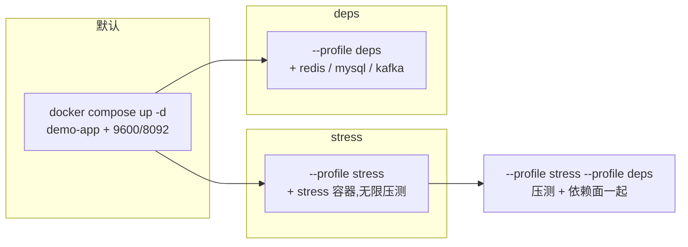

# 远端 Linux 服务器:compose 全面验证与压测

面向"在一台专用 Linux 服务器上,把 `agent/demo-app/docker-compose.yaml` 这套编排完整跑一遍"——
**看效果 / 压测 / 依赖面**三种目的各一条命令,以及把所有坑集中列在一处,免得边跑边踩。

> 只想在本地 Windows 上手工点一点,看 [`README.md`](README.md)(含 `pwsh` 脚本)或
> [`../../verify/README-starter.md`](../../verify/README-starter.md)(上手主线)。
> **这份文档只讲 Linux 服务器 + docker compose。**

---

## 0. 三个 profile,按目的选



| 目的 | 命令 | 起什么 |
| --- | --- | --- |
| 只看效果 | `docker compose up --build -d demo-app` | 应用 + H2 控制台 |
| 压测(指标) | `docker compose --profile stress up --build -d` | 上面 + `stress` 容器(无限压测) |
| **长期跑(数天以上)** | 同上,但**另见 §5.1** | 同上;观测项是趋势与重启次数,不是峰值 |
| 看依赖面分层 | `docker compose --profile deps up --build -d` | 应用 + redis/mysql/kafka |
| **压测 + 依赖面** | `docker compose --profile stress --profile deps up --build -d` | 全套;**并按 §4 换掉 `loadtest.paths`** |
| 跑断言回路 | `bash verify/run.sh --scenario logfile-reporter` | 另一条路(容器化,见 §6) |

⚠️ `stress` 与 `deps` 是**独立** profile:只起 `stress` 时 redis/mysql/kafka **并不在**,
而 `demo-app` 的 `DEPS_*` 指向容器服务名 → 解析失败。这不是故障,见 §7 的坑 2/3。

⚠️ **"压测"和"长期跑"不是同一件事**:`stress` 档本身是无限循环(`durationSec=-1`)、
天生适合长期跑,但 §3 的观测项是给"跑一遍看峰值"用的。长期跑要盯的是
**重启次数与内存趋势**,且 `docker compose ps` 在这里会骗你 —— 见 **§5.1**。

---

## 1. 前置

| 项 | 要求 | 检查 |
| --- | --- | --- |
| Docker | Linux 引擎 + compose **v2**(`docker compose`,不是 `docker-compose`) | `docker compose version` |
| 端口 | `9600`(应用)、`8092`(H2 控制台)空闲;用 deps 时再占 `16379` / `13306` / `19092`(宿主映射;**容器内**仍是 6379/3306/9092) | `ss -lntp \| grep -E '9600\|8092'` |
| 内存 | 全部起齐约 **2.5g**(demo-app 1g + stress 2g + redis 256m + mysql 512m + kafka 768m) | `free -g` |
| 磁盘 | 首次构建镜像 + maven 缓存,预留 **10g+** | `df -h` |
| 网络 | 能拉 `maven:3.8.6-eclipse-temurin-8`、`eclipse-temurin:8-jre-alpine` 等基础镜像;agent 发行包走 `archive.apache.org` | 见 §7 坑 1 |

代码准备:

```bash
git clone <repo> && cd skywalking-javaPluginExtensions/agent/demo-app
# 首次构建会装插件 + agent + demo 应用,10~30 分钟;之后有缓存就快得多
```

---

## 2. 起、确认、再造数

```bash
docker compose up --build -d demo-app
docker compose ps            # STATUS 出现 (healthy) 才是真就绪
```

首次启动 1~2 分钟(JVM + agent 增强)。`starting` 不代表失败。

**造数**(图是空的就没法验证;依赖边是**分钟级窗口**,压测停了要看图得重新造):

```bash
# 全貌入口:每种被监控的组件各打一次(tomcat/@Trace/MyBatis/JDBC/HttpClient/Redis/MySQL/Kafka/外呼)
curl -s "http://127.0.0.1:9600/fullSample"

# 依赖面四层一次
curl -s "http://127.0.0.1:9600/api/deps-demo/all"

# 或者分层单独造(能分别造慢边/失败)
curl -s "http://127.0.0.1:9600/api/deps-demo/redis?op=set"
curl -s "http://127.0.0.1:9600/api/deps-demo/mysql?sleepMs=300"
curl -s "http://127.0.0.1:9600/api/deps-demo/kafka?op=produce"
curl -s "http://127.0.0.1:9600/api/deps-demo/http?site=httpbin"

# 告警(最直观的可见效果)
curl -s "http://127.0.0.1:9600/api/trace-alert-demo/error"
curl -s "http://127.0.0.1:9600/api/trace-alert-demo/slow?ms=4000"
```

| 页面 | 地址 | 看什么 |
| --- | --- | --- |
| 能力导览 | `/` | 插件是什么 |
| 仪表盘导航 | `/dashboards/index.html` | **必须带 `index.html`**,`/dashboards/` 是 404 而 404 会真的发一条 ERROR 告警 |
| Trace 告警 | `/dashboards/dashboard.html?p=alert` | 慢/错事件列表 |
| 指标大屏 | `/dashboards/metrics.html` | QPS / 错误率 / 分位 |
| 依赖拓扑 | `/dashboards/topology.html` | 左=本服务单点,右=组件节点(点「停止刷新」再截图) |
| H2 影子库 | `http://127.0.0.1:8092` | 登录 URL `jdbc:h2:mem:sw_trace_segment;DB_CLOSE_DELAY=-1`,用户 `sa`,密码**空** |

---

## 3. 压测:容器 stress

```bash
docker compose --profile stress up --build -d
docker compose logs -f stress        # 每 10s 一行 [progress]
```

`[progress]` 行里三段要会读:

| 字段 | 含义 | 判读 |
| --- | --- | --- |
| 吞吐 | req/s | 掉了先看路径集里是不是混了慢端点(坑 4) |
| `plugin=` | `rowsUpserted` / `lateDropped` / `sampleOverflow` / `persistErrors` / `aggregateErrors` | **只看 `persistErrors` / `aggregateErrors` / `endpointOverflow` 是否恒 0**;`sampleOverflow` 增长是正常的(蓄水池抽样) |
| `heap=` | ⚠️ **压测器自己的堆,不是应用的** —— 见下 | 别拿它判断插件泄漏 |

> ⚠️ **`heap=` 不是插件的堆。** 它取自 `HttpLoadTest` 进程内的 `Runtime.getRuntime()`
> (`HttpLoadTest.java:215`),而 `HttpLoadTest` 跑在 **stress 容器**的 surefire fork 里 ——
> 那是**压测端**的内存,和插件、应用**完全无关**。拿它判断"插件是否泄漏内存"会得出
> 相反的结论(压测器平稳、插件却在涨,正好被这个数字掩盖)。
>
> **要看内存泄漏,盯 demo-app 容器**,见 §5。

已知的资源约束(容器里写死了,别改):`MAVEN_OPTS=-Xmx256m` + `-DargLine=-Xmx512m` + `mem_limit: 2g`。
历史事故:maven JVM 与 surefire fork 都不带 `-Xmx`,在 cgroup 下被 OOM kill 后 `restart` 成循环
(实测 `RestartCount` 数百次,表现为指标出现分钟级空洞)。检查:

```bash
docker inspect --format '{{.RestartCount}}' <stress 容器>     # 应恒 0
```

---

## 4. 压测 + 依赖面一起(要改一行)

两个 profile 一起起时中间件**是**通的,此时应该让压测把依赖面也压上:

```bash
docker compose --profile stress --profile deps up --build -d
```

编辑 `docker-compose.yaml` 的 `stress.command`,把 `-Dloadtest.paths` 换成:

```
-Dloadtest.paths=/hello,/fullSample,/api/deps-demo/redis?op=set,/api/deps-demo/mysql,/api/deps-demo/mysql?sleepMs=30,/api/deps-demo/kafka?op=produce,/api/deps-demo/http?site=httpbin,/queryDbByMybatis,/queryDbByJdbc,/longTimeTask
```

变化点:`/fullSample` 去掉 `?deps=false`(让全貌入口带上三层),并显式补上可单独造慢边的 deps 路径。

`loadtest` 参数含义:`baseUrl` / `durationSec(-1=无限)` / `threads` / `progressSec` / `paths`。

---

## 5. 压测中/后的观测点

| 想看 | 打开 | 备注 |
| --- | --- | --- |
| 插件内部计数 | `/inner/sw/metrics` 的 `counters` | 应该全是 0,`rowsUpserted` 除外 |
| 端点级分位 | `/dashboards/metrics.html`、`metrics-troubleshoot.html` | 前者加权平均口径,后者"最差分钟"口径,**勿混用** |
| 依赖边与分位 | `/dashboards/topology.html` | **纯内存、分钟级窗口、重启即失** —— 压测停了要在几分钟内看 |
| 告警事件 | `/dashboards/dashboard.html?p=alert` | 清空:`POST /inner/sw/trace-alert/clear`(GET 会 405,而 405 本身又变成一条新 ERROR 告警) |
| 应用日志 | `docker compose logs demo-app` | |
| agent 日志 | `docker compose exec demo-app tail -n 50 /opt/skywalking-agent/logs/skywalking-api.log` | 插件加载、告警判定 |

### 5.1 长期跑（数天以上）与"跑一遍"的观测项不同

跑一遍看的是**峰值**；长期跑看的是**趋势与异常**，而 compose 默认配置里有两处会让
"看起来一切正常、实际早已在崩"——所以下面前两项不是可选项。

| 观测项 | 命令 | 判据 |
| --- | --- | --- |
| **① demo-app 重启次数** | `docker inspect --format '{{.RestartCount}}' $(docker compose ps -q demo-app)` | **必须恒 0** |
| **② demo-app 内存** | `docker stats --no-stream demo-app` | 在 GC 回落区间震荡 = 正常；**单调爬向 `mem_limit`(1g) = 泄漏** |
| ③ 插件内部计数 | `curl -s http://127.0.0.1:9600/inner/sw/metrics \| jq .counters` | `persistErrors` / `aggregateErrors` / `endpointOverflow` / `lateDropped` **恒 0**；`sampleOverflow` 涨是正常的(蓄水池抽样) |
| ④ 吞吐 | `docker compose logs stress \| grep progress \| tail` | `rps` 应平稳；**缓慢单调下滑 = 应用侧退化**，比"低于某个数"更值得警惕 |
| ⑤ 指标连续性 | `/dashboards/slow-topn.html` 的 `bucketCount` 列 | 出现**断崖** = 那一分钟重启过(见下"重启会掩盖一切") |
| ⑥ 磁盘 | `docker system df` | demo-app 日志 50m×5、stress 各 10m×5，都已封顶；maven 缓存卷会随首次构建长几 GB |

**① 为什么排第一：`restart: unless-stopped` 会掩盖一切。** 容器被 OOM kill 后会自动起来，
`docker compose ps` 显示 `Up`、页面照常能开——但 H2 影子库是 `jdbc:h2:mem:` **纯内存、
进程退出即丢**（ADR-05 已定它是终态，不是缺陷）。于是重启一次：

- 指标**归零**，曲线出现"归零后重新爬升"的假象，看起来像 GC 正常回收；
- 泄漏被**清零**，正好掩盖"泄漏到 OOM"这个事实本身。

所以**别只看 `docker compose ps`**，那个字段在这里是骗人的。

**② 用 `docker stats` 而不是 `[progress]` 的 `heap=`**：后者是压测器的堆（见 §3 警告）。

**无人值守**（跑几天没人盯日志 = 白跑）——挂一条 cron 把异常条件变成非零退出码 / 告警：

```bash
# 每 10 分钟巡检一次;任一项不达标就退出非 0,交给你的监控去告警
R=$(docker inspect --format '{{.RestartCount}}' $(docker compose ps -q demo-app))
[ "$R" = "0" ] || { echo "demo-app 重启了 $R 次(被 OOM kill?)"; exit 1; }
M=$(docker stats --no-stream --format '{{.MemPerc}}' demo-app | tr -d '%')
[ "$M" -lt 80 ] || { echo "demo-app 内存 $M%,接近 mem_limit 1g"; exit 1; }
C=$(curl -s http://127.0.0.1:9600/inner/sw/metrics \
     | jq '[.counters.persistErrors, .counters.aggregateErrors, .counters.endpointOverflow] | add')
[ "$C" = "0" ] || { echo "插件计数非 0: $C"; exit 1; }
echo "OK $(date -Is)"
```

⚠️ 这段**没有**校验 `lateDropped`：它是否增长取决于滚动间隔与到达时序，作为定时任务
容易误报。要看它就人工翻日志。

---

## 6. 另一条路:容器化断言回路

`verify/` 是仓库的**主验证路径**(与 compose 压测互补:它给"没弄坏"的判据,不是给吞吐)。

```bash
# 在仓库根目录
bash verify/run.sh --list
bash verify/run.sh --scenario logfile-reporter
bash verify/run.sh --matrix          # 附带各场景的依赖版本矩阵
```

它自己构建 agent + 插件 + demo 并起应用,跑完停掉,给退出码:
`0` 全绿 / `1` 构建失败 / `2` 应用未就绪 / `3` 插件未加载 / `5` 断言失败。
首次会构建运行器镜像并把 maven 依赖缓存进 Docker 卷 `skywalking-verify_verify-m2`。

断言里与依赖面相关的部分(分层设计,没有中间件也能过):组件识别、造数端点不挂住、
白名单外呼拒任意 URL;中间件在场时才额外断绿边。细节见
[`checks.sh`](../../verify/scenarios/logfile-reporter/checks.sh)。

---

## 7. 坑(全部集中,按踩到概率排序)

| # | 现象 | 根因 | 怎么办 |
| --- | --- | --- | --- |
| 1 | 构建/拉镜像失败:超时或 socket 耗尽 | 网络或代理。Windows 上尤其常见 Docker Desktop 残留系统代理 `127.0.0.1:7897` | Linux 上检查 `docker info` 里的 proxy;必要时配 daemon.json 的 `registry-mirrors`;两个 Dockerfile 已刻意不写 `# syntax` 行,若报 `docker/dockerfile:1` 说明被改回去了 |
| 2 | 拓扑图上 **Redis / MySQL 节点缺席**(不是红边) | 连接建立失败**不产生出口 span**(span 建立在"连接已建立之后的调用"上,`connection refused` 发生在它之前) | 预期行为。**缺席 ≠ "没有这个调用"**,要确认失败现场看链路视图。要看这两层节点就得把 deps profile 起来 |
| 3 | **Kafka / 外呼的边 `errorCount=0`,可调用其实失败了** | agent 的 kafka producer span 靠 `send()` 的**异步 callback** 回填错误;broker 不可达时 `send()` 同步等满 `max.block.ms` 抛超时,**没有 callback** | 预期行为,agent 侧限制。**线索是耗时**:≈ 超时上限(默认 3s)就是失败。判断成功与否以端点响应体/业务日志为准,别只看颜色 |
| 4 | 吞吐低得离谱、`[progress]` 间隔很长 | 路径集里混了慢端点:`/api/order/1`(8.5s)、`/api/trace-alert-demo/slow`、`/longTimeTask`、`/api/deps-demo/kafka`(broker 不可达时 3s)、`/fullSample` 默认带三层时 ≈8s | 纯指标压测用不带 deps 的路径集(默认那行就是),`/fullSample` 加 `?deps=false` |
| 5 | 指标出现分钟级空洞 / `RestartCount` 暴涨 | stress 容器被 cgroup OOM kill 后重启循环 | 保持 `MAVEN_OPTS` / `-DargLine` 两处堆封顶 + `mem_limit: 2g`;`docker inspect --format '{{.RestartCount}}'` 应恒 0 |
| 6 | 压测中计数暴涨、负载异常放大 | 压测含错误端点 → 插件**同步 webhook 回打自身**形成放大回路 | 压"纯指标"时用不含 error 的路径集(默认那行),或删掉 `demo-app.command` 里的 alert 参数 |
| 7 | 重新部署后指标归零 | H2 影子库与边聚合都是 `jdbc:h2:mem:` 纯内存,**进程退出即丢**;`docker load` 同 tag 新镜像会让容器重建 | 只想改压测路径就别重建 demo-app 容器;接受归零就重新造数 |
| 8 | `depends_on` 报"服务未定义" | 跨 profile 的 `depends_on` 在 compose v2 里会报错 | 本编排**故意不给** demo-app 加 deps 依赖,靠服务名解析失败来表达"中间件不在场" |
| 9 | 9600 端口被占 | 之前有实例没退干净 | `docker compose down` / `ss -lntp \| grep 9600`;应用默认端口是 `9601`,compose 用 `WebPort=9600` 显式指定 |
| 9b | `Bind for 0.0.0.0:6379/3306 failed: port is already allocated` | 宿主上这些端口被**别的栈**占着(很常见:本机的 RuoYi 之类自带 redis/mysql) | 本编排已把宿主映射改成 `16379` / `13306` / `19092`(容器内不变)。真要占用标准端口就把映射改回去,并先停掉占用方 |
| 9c | 拉镜像报 `proxyconnect tcp: dial tcp 127.0.0.1:7897: connection refused` | **Docker Desktop 没启用 Manual 代理时，daemon 直接继承 Windows 的系统代理**（`Internet Settings` 的 `ProxyServer`）。而 Linux 引擎跑在 WSL2 发行版里，它看到的 `127.0.0.1` 是**虚拟机自己的回环**，那里没有代理 | 先 `docker info` 看 daemon 实际用的代理值（那是真值来源，别看界面）。修法：Resources → Proxies → 开 **Manual**，两栏填 `http://host.docker.internal:7897`（**不要清空**）→ Apply & restart；或改 Windows `ProxyServer` 后彻底重启 Docker（OS 级改动，会影响其它走系统代理的应用）。详见 `NOTES-docker-stress.md` 第 13 条 |
| 10 | H2 控制台用宿主 IP 访问返回 404 | H2 2.1.212 的 `WebThread.checkHost` 只放行 server 自身地址与 `localhost`/`127.0.0.1` | 用 `http://127.0.0.1:8092`;远程访问走 SSH 端口转发 `ssh -L 8092:127.0.0.1:8092 user@host` |

---

## 8. 收工

```bash
docker compose down                # 停容器并删除(volume 保留,下次启动更快)
docker compose --profile stress --profile deps down   # 同上,显式带 profile
docker compose down -v             # 连 maven 缓存卷一起删(下次从零开始)
docker image rm demo-app-agent:9.4.0    # 想彻底重来时
```

跑过 §6 的话,它的 maven 缓存在 Docker 卷 `skywalking-verify_verify-m2`,`down -v` 会一起清掉。
