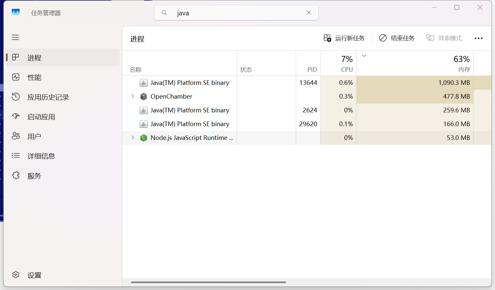
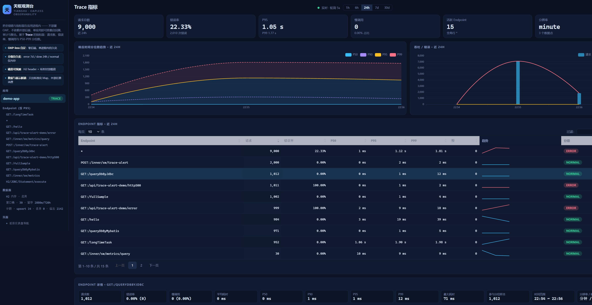
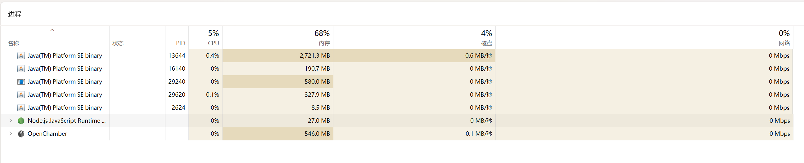
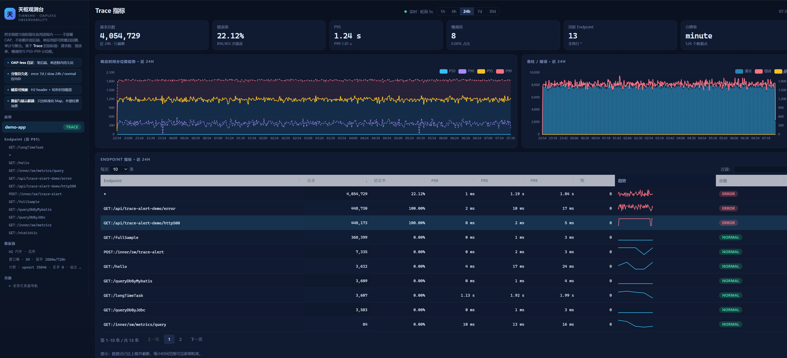

# 2026-09-25: 持续压测下的插件内存分析——1G→3.4G 是健康的高水位

> 范围：`logfile-reporter-plugin` 在 **8 小时持续压测**（`scripts/stress.ps1 -Continuous`）后的 JVM 内存判读。
> 状态：经验结论，非规范；针对 **JDK 8 + Parallel GC + demo-app**，换 JDK/GC/负载会变。

## 背景

压测方式：`agent/demo-app/scripts/stress.ps1 -Continuous`，由测试类 `org.openskywalking.demo.load.HttpLoadTest`（`agent/demo-app/src/test/java/.../load/HttpLoadTest.java`）发负载——8 线程、~48 rps、默认 7 条路径（正常 + `/api/trace-alert-demo/error` + `/http500` + `/longTimeTask`）。

被观测进程：demo-app（JDK 1.8.0_92、SkyWalking Agent 9.4.0、Parallel GC、`-Xmx≈7G`＝物理 32G 的 1/4），持续运行约 8 小时。

**现象**：任务管理器/Arthas 看到内存从启动时 ~1G 涨到 ~3.4G，疑为泄漏。

**结论**：**健康，不是泄漏。** 涨上去的是 JVM 堆的 **committed（高水位预留）**，不是存活对象；真实存活只有 **~100MB**，且 committed 已 plateau。

## 实测证据

堆（Arthas `memory`，两次采样间隔 45s）：

| 量 | T0 | T1(45s) | 解读 |
|---|---|---|---|
| heap used | 704M | 2097M | 全在 Eden 波动 |
| heap committed | 3325M | **3325M** | 不动＝高水位 |
| ps_old_gen used | 99M | 99M | Full GC 后存活低 |
| heap max | 7216M | 7216M | `-Xmx` |
| Scavenge / MarkSweep | 867 / 7 | 867 / 7 | 45s 内 0 次 Full GC |

- OS：WorkingSet **3.40GB** / Private **4.32GB**。
- `jmap -histo:live`（触发 Full GC 后）：**存活 104,501,584 B ≈ 99.7MB**，6,670 个类；Top 为 `char[]`、`HashMap$Node`、`byte[]` 等通用对象。各来源：插件 `reporter.logfile.*` 合计仅 **6.5KB**、H2≈4.67MB、skywalking≈6.07MB、Arthas≈1.66MB。
- 早前 `ps_old_gen used=407M` 是**未 Full GC 的含浮动垃圾占用**；Full GC 后掉到 99M——这正是"非泄漏"的直接证据。

### 观测快照（本轮压测实拍）

**起点**（22:54 左右）：任务管理器里 PID 13644 = **1,090.3 MB**；仪表盘只有 3 个数据点 / 9,000 请求。

| 起点 · 进程内存（任务管理器） | 起点 · Trace 指标盘 |
|---|---|
|  |  |

**长跑后**（次日 07:37~07:39）：任务管理器里 PID 13644 内存列涨到 **2,721.3 MB**（后续 Arthas 读到 WorkingSet ≈ **3.4 GB**）；指标盘累计 **4,954,729** 请求、**526** 个数据点，并提示「数据点已达上限并截断」。

| 长跑后 · 进程内存（任务管理器） | 长跑后 · Trace 指标盘 |
|---|---|
|  |  |

> 两张任务管理器截图正是「1G→3.4G」的来源——它显示的是**进程 RSS/工作集**，不是存活对象；两张指标盘截图对应 `rowsUpserted`（14 → 35946）与请求累计，说明"持续运行、指标持续累积"，与 JVM 存活集（~100MB）无关。

## 为什么 1G→3.4G（关键）

五种"内存"要分清：

| 概念 | 含义 | 本进程 |
|---|---|---|
| **live** | Full GC 后真正存活对象 | **~100MB** ← 实际用了多少 |
| **used** | 含未回收垃圾 | 0.7–2.1GB（Eden 抖动） |
| **committed** | JVM 向 OS 保留的堆容量 | **3.25GB（高水位）** |
| **WorkingSet / Private** | OS 侧已触碰页 / 提交 | 3.40GB / 4.32GB |
| **max** | `-Xmx` | 7GB |

机制：
1. 压测高分配率把 **Eden 顶到 ~2.2GB**（每请求产生 segment→Log/SpanInfo→`HashMap`/`String`→H2 指标 JSON→GZIP→webhook JSON）。
2. **Parallel GC 按分配速率自适应扩代**。
3. **Java 8 默认 `-XX:MaxHeapFreeRatio=100`、`MinHeapFreeRatio=0`**：扩容后**不主动归还** OS。
4. committed 停在**峰值附近**不再随存活集走；上界 `-Xmx`。

判定健康的依据：committed 已 plateau ✅；Full GC 后存活 <200MB 且不升 ✅；Full GC 次数少（7）✅；无 OOM / `persistErrors` / `aggregateErrors` ✅。

**出现以下才需担心**：committed 持续顶向 `-Xmx` 不回、存活集一路爬向 GB、Full GC 几秒一次、OOM。

## 压测的放大效应：ERROR webhook 风暴

压测默认含错误端点，触发了插件告警自环：

| 指标 | 值 |
|---|---|
| `dispatchSubmitted` / `dispatchErrorCount` | **866,239 / 866,231**（慢仅 8） |
| `httpWebhook.totalAttempts / success` | **866,239 / 866,239**（失败 0） |
| `dispatchRejected` / `dispatchSkippedDuplicate` | 0 / 0 |

每次错误请求 → 插件**同步 POST 回同一个 app** 的 `/inner/sw/trace-alert` → 该 POST 又被 agent 采集 → 有效流量被放大，Eden 高分配率相当部分来自这条自环（webhook body＝整个 trace JSON）。接收端 `TraceAlertWebhookStore`（`agent/demo-app/.../tracealert/TraceAlertWebhookStore.java`）`MAX_EVENTS=50`，有界。

## 压测姿势：指标稳定性与告警稳定性要分开压

分层：**告警开关属于"应用启动"层**（`run-with-agent.ps1`），**打哪些端点属于"压测"层**（`stress.ps1`）。

- **纯指标稳定性**：`run-with-agent.ps1 -NoAlert` 起实例（alert off，无 webhook 自环） + `stress.ps1 -NormalOnly`（只压正常端点，排除 `/error`、`/http500`）。
- **指标 + 告警耦合**：`run-with-agent.ps1`（默认 alert on） + `stress.ps1`（默认混合路径含 error）。
- ⚠️ 混在一起时（本次 PID 13644 即 `run-with-agent.ps1` 默认启动 + 默认混合路径），指标与告警是**耦合观测**的——Eden 高分配率与 `NotifiedFlagsCache` 的增长里有很大一部分来自告警/webhook，不能单独归因给指标聚合。
- 佐证：`stress.ps1 -StartApp` 自己起的应用**不带 alert**（纯指标路径）；本次 13644 是 `run-with-agent.ps1` 起的（alert 开）才有 ERROR webhook 自环。

## 插件侧结构有界性清单

| 结构 | 压测实测 | 上界 / 风险 |
|---|---|---|
| `NotifiedFlagsCache`（Guava，TTL 10min，`alert/NotifiedFlagsCache.java`） | `StrongWriteEntry=17150` | **无 maximumSize**，≈QPS×600s；唯一缺硬上限 |
| `TraceMetricsAggregator` 蓄水池（`metrics/TraceMetricsAggregator.java`） | `[J` 2.7MB（≈52×`long[5000]`）；内存桶 54 行；`sampleOverflow=1,380,822`（仅计数） | 3min 窗口 × (端点≤500+`*`) × 40KB/键 ≈ **最坏 ~80MB** |
| H2 指标表（mem，`storage/H2SqlStatements.java`） | 分钟全局行 507≈运行分钟数 | 分钟 48h / 小时 30d × 端点，随基数线性 |
| H2 `trace_segment` | `h2Size=2000` 恒定、`writeQueueDropped=0` | `h2.shadow_max_rows=2000` |
| `KeyedLocalStore` | — | `max_log_size=1000` |
| 环形载荷文件 | direct/mapped≈168K | 128MB **磁盘**，不占堆 |
| 告警队列（`alert/AsyncTraceAlertDispatcher.java`） | 512，`rejected=0` | 有界 |
| webhook 监听器（`alert/HttpTraceAnomalyListener.java`） | 单线程同步 | **不新建线程** |
| 插件常驻线程 | 3 个（`H2Shadow-Writer`/`LogfileTraceAlert`/`TraceMetrics-Flush`） | O(1)；`STARTED-COUNT=6063` 多为 Tomcat/JIT/Arthas |

### 两个真实增长点（详情）

1. **`NotifiedFlagsCache` 无 `maximumSize`**（见上表）：≈ QPS×600s，随 QPS 线性增长。
2. **端点基数 × 蓄水池**：真实应用 URL 带 path 变量时，端点会冲到 `MAX_ENDPOINTS_PER_BUCKET=500`（`endpointOverflow` 此时才开始计数）；则 `4×501×40KB ≈ 80MB` 仅为样本数组（每键一个 `long[5000]`），且分钟表行数 ×500。**当前压测端点是固定的 7 个，所以 `endpointOverflow=0`，观察不到这个上限。**

## 建议

- JVM：压测固定 `-Xms2g -Xmx2g`；或 `-XX:MaxHeapFreeRatio=30 -XX:MinHeapFreeRatio=10` 让 PS 收缩；或 `-XX:+UseG1GC`（Java 8 支持）。Windows 上即便 JVM 归还 committed，任务管理器工作集也可能滞后回收，属正常。
- 代码：`NotifiedFlagsCache` 加 `maximumSize`（性价比最高）；蓄水池改懒分配/直方图（spec 的 v2），把最坏 80MB 降为常量。

## 复核命令

```powershell
curl.exe -s --noproxy "*" http://127.0.0.1:9600/inner/sw/metrics        # 插件计数
curl.exe -s --noproxy "*" http://127.0.0.1:9600/inner/sw/trace-parity   # H2 明细/队列
curl.exe -s --noproxy "*" http://127.0.0.1:9600/statisticTraceAlert     # 告警/webhook 计数
"D:\apps\java\jdk1.8.0_92-64\bin\jmap.exe" -histo:live <pid>            # 存活对象（触发一次 Full GC）
java -jar <arthas-boot.jar> -c "memory; jvm" <pid>                       # 堆/GC/线程
```

## 一句话

**真实存活 ~100MB；1G→3.4G 只是 Parallel GC + Java 8 不归还空闲堆造成的 committed 高水位，且已 plateau、远未触及 `-Xmx`；插件结构均有界，唯一建议补硬上限的是无 `maximumSize` 的 `NotifiedFlagsCache`。**
