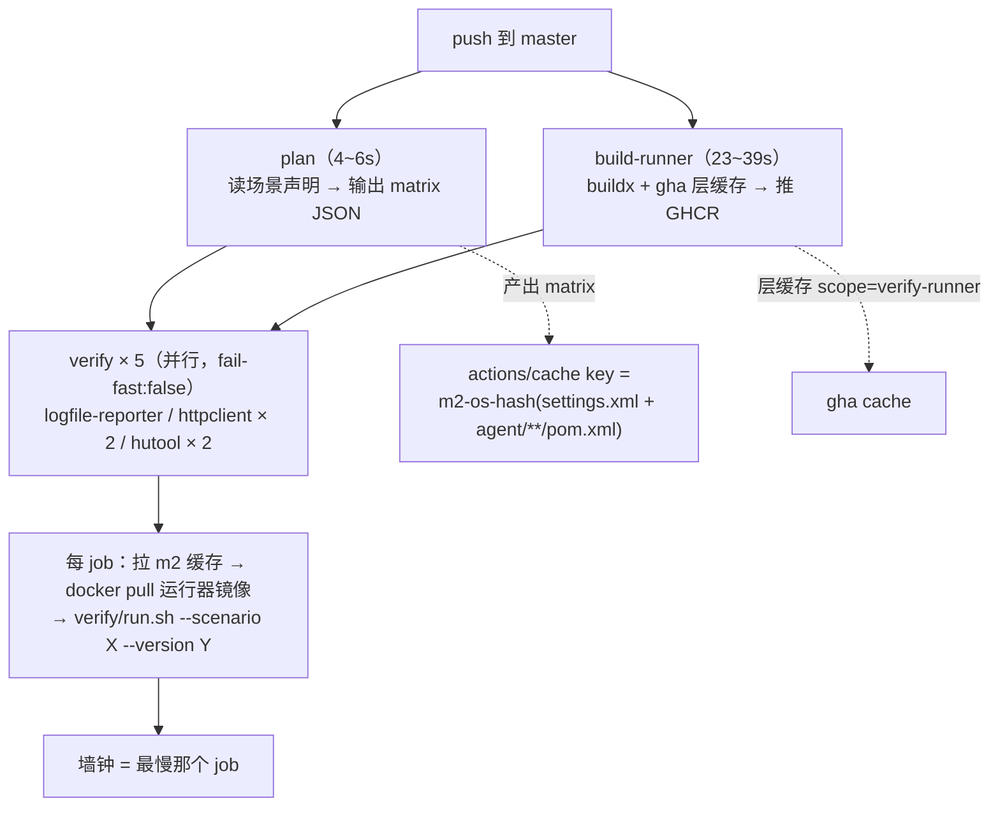
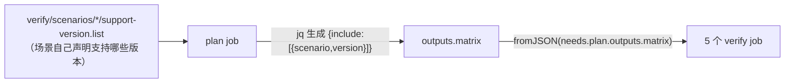

# GitHub Actions：缓存、矩阵、镜像分发与排错（本轮实跑经验）

- **何时读**：改 `.github/workflows/*.yml`、CI 跑得慢或莫名变红、看到看不懂的报错想在动手前先判断时。
- **性质**：**经验沉淀，不是规范**。每条都来自 2026-10-01 那一轮实跑（10 个提交、4 次红 6 次绿），数字是当次实测。
  规范性的约定在 `docs/repo/` 与 `AGENTS.md`。
- **读者假设**：知道 CI 大概是什么，但没系统碰过 Actions。

---

## 零、先建立心智模型

GitHub Actions 和"自己机器上跑 CI 脚本"的根本差别只有一句：

> **runner 是一次性 VM**。每个 job 拿一台全新的、没有任何 state 的机器，跑完销毁。

这一句推导出后面所有的坑：缓存不会自己留着、镜像每次都要重拉、依赖每次都要重下。**所有优化都只是在对抗这一条。**

本仓 `verify.yml` 现在的形状（一次 push 触发的全貌）：



**为什么是这个形状**：`plan` 与 `build-runner` 无依赖、并行跑；5 个 verify job 各等两者都完成后一起铺开。
墙钟 ≈ 23s（build）+ 最慢 job ≈ **141s**。

---

## 一、缓存：能省"下载"，省不了"计算"

| 手段 | 缓存什么 | key 随什么变 | 落点 |
| --- | --- | --- | --- |
| `actions/cache` | 你指定的任意路径（本仓是 `.m2-verify`） | 你自己写 `key`，本仓 hash 了 `settings.xml` + `agent/**/pom.xml` | `restore-keys` 前缀兜底 |
| `setup-java` 的 `cache: maven` | `~/.m2/repository` | 自动 hash `**/pom.xml` | 自动 |
| buildx 的 `type=gha` | Docker 层（`mode=max` 连中间 stage 一起） | 层内容本身（命中即 `CACHED`） | `scope=` 命名 |

**三条必须知道的规则**（都不是猜的，是文档写明 / 实测确认）：

1. **7 天未访问即驱逐，仓库总量上限 10GB**。所以缓存 key 设计成"随 pom 变 + 前缀兜底"，
   而不是"永久固定 key"——固定 key 命中率高，但内容永远不更新。
2. **fork PR 的 token 是只读的**：保存失败**只 warning，不 fail job**。放心让外部 PR 跑。
3. **`type=gha` 的 cache-to 导出失败默认致命**，要显式 `ignore-error=true`。
   但注意下一节——**它挡不住能力缺失**。

> **第一次跑必然还是慢**，因为缓存要在 job 的 post 步骤才存。这不是没生效，是一次性成本。
> `build-and-test` 加 `cache: maven` 后首跑 48s，落在它历史区间 35~49s 内——单次样本分辨不出收益，
> 这类结论只能等第二次跑。

---

## 二、Docker 镜像：三条路，各自的代价

| 方案 | 上传 | 下游 job 拉取 | 镜像没变时 |
| --- | --- | --- | --- |
| A 各 job 自己 build | 0 | 从 gha cache 导层 + `load` 进 docker image store | 导层仍要走一遍 |
| B build 一次 → artifact 分发 | ~1GB | 3 份各 ~1GB（gzip 来回一趟） | 照传 |
| C build 一次 → 推 registry（GHCR） | 内容寻址 | `docker pull` 走 registry 压缩层 | **只传 manifest（KB 级）** |

**本仓选了 C**，因为 registry 是内容寻址的：镜像没变时 blob 已存在，重推只 PUT 一个 manifest。
实测首次推约 1GB 用了 24s，之后每次只几秒。

### 三个坑（每一个都让 run 在十几秒内失败，且失败形态很有误导性）

**1. 默认 driver 不支持 gha 缓存导出**

```
buildx failed with: failed to build: Cache export is not supported for the docker driver.
```

`docker/build-push-action` 用 runner 上默认的 builder，而默认是 `docker` driver。
**先装 `docker/setup-buildx-action`**（它建 `docker-container` driver 的 builder）才能用 gha 缓存。

> **关键教训**：`ignore-error=true` 只覆盖"导出超时"，**不覆盖"能力缺失"**。
> 这类报错是 build 期直接失败，`ignore-error` 根本没参与。

**2. `build-push-action` 不认证 registry**

```
failed to fetch anonymous token: ... https://ghcr.io/token?... 403 Forbidden
```

看它的 `action.yml`，`github-token` 的描述是 *"used to authenticate against a repository for
**Git context**"* —— 只管 **Git 源**认证，不管 registry 推送。
**推 registry 前必须显式加一步 `docker/login-action`。**

**3. GHCR 镜像名必须全小写**

`github.repository` 带大写字母（如 `skywalking-javaPluginExtensions`）会直接被 registry 拒。
workflow 里有一道 `tr '[:upper:]' '[:lower:]'`，顺带把结果写进 `$GITHUB_ENV` 给后续步骤复用。

---

## 三、matrix：并行度 ≠ 更快

**坑：matrix 必须是映射，不能是裸数组。**

```
Error when evaluating 'strategy' for job 'verify'. (Line: 139, Col: 15): A sequence was not expected
```

`matrix: [ {...}, {...} ]` 不行，必须 `matrix: { "include": [ {...} ] }`。
**这个错误的迷惑性在于**：`plan` 和 `build-runner` 都是绿的，只有 `verify` 一个 job 都没创建——
矩阵是在 job 实例化**之前**展开的，所以看起来像"第三个 job 卡住了"，实际是它压根没资格被创建。

**坑：加了 `needs` 就有串行化。**

方案 C 每个 job 省下 32~39s（pull 比导层+load 快），但 `needs: build-runner` 让构建串在最前面，
吃掉大部分收益：

| | 方案 A（各 job 自建） | 方案 C（build 一次 + GHCR） |
| --- | --- | --- |
| 单个 job | 96~144s | **53~113s** |
| build job | — | 23~39s |
| **墙钟** | **146s** | **141s** |

净省 5s。**不是 bug，是"省下的时间"和"新增的串行点"量级相当。**
要真正吃到那 30s 得再拆一个 `prepare` job 让缓存恢复与构建并行——不值得。

**动态矩阵**（本仓做法，避免 CI 抄一遍场景清单）：



加版本只改 `.list` 一个文件，CI 自动跟随。

**两条卫生习惯**：

- matrix 值走 `env:` 传进 `run:`，**不内插进脚本文本**（`--scenario "$VERIFY_SCENARIO"`）。
- `fail-fast: false`：一个场景挂了不该掐掉其余——全跑完才知道是"只坏一个"还是"全坏"。

---

## 四、`paths` 白名单语义（本轮最大的坑）

```yaml
on:
  push:
    paths: ['verify/**', 'agent/...', 'demo-app/**']   # ← 白名单，不是黑名单
```

**语义是"只有这些路径变了才跑"**，不是"这些路径变化时不跑"。

后果：**改 workflow 文件本身不会触发它自己**。本轮 `1b0c09e` 只改了 `verify.yml`，
push 之后 GitHub 上**根本没有 run**——当时误以为是 Gitee→GitHub 镜像延迟，
实际是过滤器直接判定"这次不该跑"。

修法（两个 workflow 都有）：

```yaml
      # 带自身路径:否则改 workflow 永远不触发它自己,验证逻辑改动得不到验证
      - '.github/workflows/verify.yml'
```

**顺带解掉一个鸡生蛋问题**：过滤器按**推送后的 ref** 求值，所以"把自身路径加进 `paths`"
这个 commit 自己就会触发——不需要另找办法跑一次。

> 顺带还有个容易忽略的：**过滤器按 diff 判定**。如果一次 push 里没有任何一个文件命中 `paths`，
> 就一次都不跑。所以"改 A 顺便改了 B"时要看的是**整次 push 的文件集合**，不是单个 commit。

---

## 五、怎么读一次失败的 run

按这个顺序，能少走弯路：

| 顺序 | 看什么 | 判读 |
| --- | --- | --- |
| 1 | **哪些 job 存在** | "少了一个 job" ≠ 卡住，常见于矩阵展开失败或 `if` 把 job 跳过了 |
| 2 | **Annotations**（run 页和 job 页都有） | 那是真正的失败原因；**报错常挂在 workflow 级而不是出错的 job 上** |
| 3 | 步骤级耗时 | 几十秒就失败 = 配置/权限/语法问题；几分钟才失败 = 真在构建或跑测试 |
| 4 | 具体日志行 | 报错原文进代码块，别转述 |

**两个会打断排查的环境限制**（都实测踩过）：

- **匿名 GitHub API 只有 60 次/小时**，轮询几次就 403。排查期间改用网页看，
  或 `GET /rate_limit` 看 `reset` 时间。
- **登出状态下日志看不到**，只能看 annotations 摘要。完整日志要么登录，要么本地复现。

**本地复现的技巧**（比在 CI 上试快得多）：让脚本在**真正需要外部依赖的那一步之前**停下来。
比如验证参数校验逻辑时把 docker 指向一个死地址：

```bash
DOCKER_HOST=tcp://127.0.0.1:1 VERIFY_SKIP_BUILD=1 bash verify/run.sh --scenario X --version Y
# 参数校验路径全测得到，且秒级返回
```

在容器里跑 CI 脚本也能对齐环境（runner 上有 `bash` + `jq`，本机 WSL 常常缺 `jq`）：

```bash
docker run --rm -v "D:\repo:/src" -w /src alpine:latest \
  sh -c "apk add --no-cache jq bash >/dev/null && bash /t/script.sh"
```

---

## 六、版本与迁移：怎么判断 major 能不能升

Actions 的 major 版本跳动大多是 runtime 与依赖升级，**但仍要查再升**——本轮为消两条弃用告警升了四个：

| action | 原 | 现 | 判定依据 |
| --- | --- | --- | --- |
| `actions/checkout` | v4 | v7 | Node 20 → 24 运行时（runner 强制按 Node 24 跑） |
| `actions/cache` | v4 | v6 | 同上 |
| `actions/setup-java` | v4 | v6 | v5 的 breaking 只有 Node 24；v6 的 release notes 明写 *"V6 ESM migration is not a user-facing breaking change"* |
| runner 镜像 | `ubuntu-latest` | `ubuntu-24.04` | `ubuntu-latest` 将于 2026-10-19 迁 Ubuntu 26；**钉同 major 不吃周更镜像的亏**，且避开无人值守的发行版大版本改动 |

```bash
# 看某个 action 最近发了什么 major / 有没有 breaking
curl -s https://api.github.com/repos/<owner>/<action>/releases/tags/v<N>.0.0 \
  | python -c "import json,sys; print(json.load(sys.stdin)['body'])"
```

**弃用告警本身值得处理**——它意味着 runner 已经在替你跑新 runtime，等哪天彻底停止支持就是硬失败。

---

## 七、本仓现状（指针，不重复数字）

| 想知道 | 看哪 |
| --- | --- |
| verify 回路怎么跑、场景怎么声明 | `verify/README.md` |
| 场景与矩阵 | `verify/scenarios/*/scenario.conf` + `support-version.list` |
| 两个 workflow 的完整形态 | `.github/workflows/verify.yml` / `build-and-test.yml` |
| 编排约定（脚本入口、端口） | `AGENTS.md` 的 Task routing / 验证节奏 |

---

## 八、这一轮最该记住的一条

三次失败（`ignore-error` 挡不住 driver、`build-push-action` 不认证 registry、matrix 不收裸数组）
有一个共同点：

> **都是"看起来对"，不是"跑一遍对"。**

具体说：

| 我验证了什么 | 我没验证什么 | 于是 |
| --- | --- | --- |
| jq 管道输出了正确的 JSON **内容** | GitHub 要求的**形状**（映射而非数组） | run #20 矩阵展开失败 |
| `docker compose config` 能解析配置文件 | 那个 YAML 编辑器为什么报错 | 一条误报被当成真问题排查了半天 |
| `docker buildx build --push` 的参数 | build-push-action **自己**会不会认证 registry | run #18 403 |

**教训不是"多小心"，是"验证的边界要对齐被验证对象的契约"。**
本轮三次都能在推上去之前抓到——只要验证时用的是**目标系统同款工具 + 同款输入形状**，
而不是"我本地跑通了"。第 3 条尤其：**本地 Bash / PowerShell 通过 ≠ Linux runner 上通过**
（`jq` 在本机 WSL 里就没有）。

## 九、还没验的

- **`cache: maven` 的真实收益**：`build-and-test` 首跑 48s 落在历史区间内，需第二次命中后才可比。
- **GHCR 在缓存失效时的表现**：层缓存与 GHCR 拉取同时冷启动时，总耗时没测过。
- **`actions/cache` 的 10GB 上限是否够用**：当前 m2 约 1GB + 层缓存若干，估算够，但没量过层缓存实际占用。
- **fork PR 的端到端行为**：只确认了"保存失败降级成 warning"（文档保证），没真拉一个 fork PR 试过。