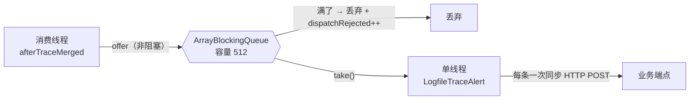

# 告警 webhook 把本机 TCP 端口池打爆（连带打挂仪表盘）

- **何时读**：仪表盘页面白屏、控制台一片 `net::ERR_INVALID_ARGUMENT` / `SRange is not defined`、
  压测时面板 QPS 明显低于压测脚本自己报的 RPS、或要改 `HttpTraceAnomalyListener` / 告警 webhook 投递时。
- **性质**：**经验沉淀 + 一个已修的产品缺陷**，不是规范。数字全部来自 2026-10-02 本机（Windows）实跑。
  **决策与取舍另见** `docs/adr/adr-05-alert-webhook-uses-pooled-http-client.md`。
- **读者假设**：知道 HTTP keep-alive 和 TIME_WAIT 大概是什么；不要求读过 JDK 源码。

---

## 零、一句话

> `HttpTraceAnomalyListener` 每投一条告警都 `disconnect()` 销毁 TCP 连接、且从不读响应体 ——
> **两条各自独立地废掉了 keep-alive 复用**。高频错误下（本机 29 分钟 7.1 万条）新建连接撞满
> Windows 默认的 13,977 个动态端口，之后**本机任何**新建连接都失败，仪表盘的 `.js`/`.css`
> 因此加载不出来，页面全白。

监控把业务打挂了 —— 违背插件自己写的「监控只能是助力，而不是阻碍」。

---

## 一、怎么发现的：从一个"QPS 疑问"往下挖

起点是"面板 QPS 只有 25~38，可压测脚本自己报 626 RPS"。**这个差 25 倍不像性能问题，像读数问题。**

### 1.1 先排除丢包

实发 2000 个 `/hello`，看插件记进去多少：

```
before GET:/hello = 684
after  GET:/hello = 2696     增量 2012 / 实发 2000  →  丢失率 -0.6%
```

插件没丢。**是面板口径问题，不是数据问题。**

### 1.2 面板 QPS 的分母

面板 QPS = `请求总数 ÷ (有数据桶数 × 60)`（"活跃平均"，空桶不进分母）。两轮截图都能对上：

| 窗口 | 请求总数 | 数据点 | 算出来 | 面板显示 |
| --- | --- | --- | --- | --- |
| 24h | 7,532 | 5 | 25.1 | 25.11 |
| 1h | 86,160 | 37 | 38.8 | 38.81 |

而压测客户端在同一台机器、同一时刻是 **626~1017 RPS**。

> ⚠️ **别拿面板 QPS 和压测脚本的 RPS 互相比**。前者是"你压的那几分钟的平均"，
> 后者是"客户端发出去的速度"。面板 QPS 适合看趋势，不适合当性能指标。

### 1.3 但持续压测时它确实上不去

`stress.ps1 -AllEndpoints -Continuous -Threads 16` 跑一小时，面板稳定在 ~38 QPS。
逐条实测 `-AllEndpoints` 那 60 条路径后发现：

| 路径 | 单请求耗时 |
| --- | --- |
| `/api/export/report`（裸调） | **65.0 s** |
| `/api/order/1` | 8.5 s |
| `/debug`（`HelloService.debug(5)`） | 5.0 s |
| `/fullSample`（裸调，默认 `deps=true`） | 4.8 s |
| `/api/trace-alert-demo/slow?ms=4000` | 4.0 s |
| `/api/deps-demo/kafka?op=produce` | 3.3 s |
| `/longTimeTask` | 1.5 s |

16 线程 ÷ 平均 ~2s ≈ **理论上限 30~40 QPS**，和面板 38.81 吻合。**不是插件慢，是线程在等慢端点。**
这条线索后来牵出了另一个缺陷 —— 慢端点里 4 条是 5xx，**持续产生告警**。

---

## 二、真正的缺陷：webhook 回打打爆端口池

### 2.1 现象

压测跑到一半，仪表盘页面白屏。控制台：

```
GET http://localhost:9600/dashboards/range.js   net::ERR_INVALID_ARGUMENT
GET http://localhost:9600/lib/echarts.min.js   net::ERR_INVALID_ARGUMENT
Uncaught ReferenceError: SRange is not defined   at metrics.html:227
```

`range.js` 没加载 → `SRange` 未定义 → 渲染链断在 KPI 之前 → 整页空白。

### 2.2 关键一步：分清"服务端坏了"和"客户端建不了连"

同一个 curl、同一个服务：

```powershell
curl.exe -sv --noproxy "*" http://127.0.0.1:9600/dashboards/range.js
```

```
*   Trying 127.0.0.1:9600...
* getsockname() failed with errno 10022: Invalid arguments
* Immediate connect fail for 127.0.0.1: Invalid arguments
```

`getsockname()` 是**客户端本地**调用 —— 它失败说明**本机连 socket 都建不出来**，
服务端根本没机会参与。`errno 10022` = Winsock `EINVAL`。

> 💡 **`.html` 能开、`.js`/`.css` 全挂** 这个组合本身就是判据：HTML 是第一个请求、抢到了端口；
> 后面那些是子资源，等它们发起时端口池已经满了。

### 2.3 量化：端口池确实满了

```powershell
(Get-NetTCPConnection -State TimeWait).Count     # 13,662
netsh int ipv4 show dynamicport tcp             # 端口数 = 13,977
netstat -ano -p tcp | Select-String ":9600"     # 到本应用 9,975 条，其中 13,271/13,662 在 127.0.0.1
```

**13,662 / 13,977 = 98%**。TIME_WAIT 每条在 Windows 上挂 **120 秒**，所以新建速率只要超过
`13977 / 120 ≈ 116 条/秒`，池子就会被填满。

### 2.4 洗掉嫌疑人

| 嫌疑人 | 判定 | 证据 |
| --- | --- | --- |
| `stress.ps1` 压测 | **无罪** | 实发 2000 请求，TIME_WAIT 增量 **-74**（净减少）；16 线程的活连接只有 **9 条** → keep-alive 正常 |
| 应用自调用 | **无罪** | `FullSampleController` / `TraceAlertVerifyController` 用的是注入的**单例** `CloseableHttpClient` |
| **告警 webhook** | **有罪** | 见下 |

### 2.5 证据在插件自己的计数里

```powershell
curl.exe -s --noproxy "*" http://127.0.0.1:9600/statisticTraceAlert
```

```json
"httpWebhook": {
  "totalAttempts": 71271,
  "successCount": 51434,
  "failureCount": 19836,
  "successRatePercent": "72.17",
  "lastFailureReason": "Invalid argument: connect"
}
```

`lastFailureReason` **就是浏览器报的那个错**。29 分钟打了 7.1 万次 webhook，
每次一条新连接 → 约 **41 条/秒**，再叠加别的流量就填满了 13,977 的池子。

---

## 三、根因：`HttpURLConnection` 的隐式连接缓存在 agent 运行时里失效

`HttpTraceAnomalyListener.onTraceAlert` 原来的样子：

```java
connection = (HttpURLConnection) new URL(targetUrl).openConnection();
// ... 只调 getResponseCode()，从不读 body
} finally {
    connection.disconnect();     // ← 销毁 socket
}
```

### 3.1 先纠正一个常见误解

**`openConnection()` 本身不建 TCP 连接**，它只是返回一个 `URLConnection` 对象，一个字节都没发。
真正的连接是懒建立的（第一次 `getOutputStream()` / `getResponseCode()`）。

而且 **`HttpURLConnection` 是"会复用"的**：建连前它查 JDK 的 `KeepAliveCache`，缓存里有没过期、
host:port 相同、请求兼容的连接就复用。所以"每条告警一条新连接"**不是 `openConnection()` 的错**。

### 3.2 原代码里有两处各自独立地废掉了复用

| 缺陷 | 为什么让复用失败 |
| --- | --- |
| `finally` 里 `disconnect()` | 从缓存取出连接 → 复用 → 发完 → 当场销毁并移出缓存。**缓存永远存不住东西**，下次只能新建 |
| 从不读响应体 | socket 里还剩未消费的字节，JDK 判定该连接**不具备复用资格**，只能丢弃 |

**两处是"或"的关系 —— 少修任何一处，复用照样为零。**

### 3.3 但把它们都修好，**仍然不够**

先修了这两处（排空 body + 去掉 `disconnect()`），并用隔离探针验证**写法本身是对的**：

```
50 次连续 POST（与修复后代码完全同写法）
  → 到目标端口的连接数 10 → 10，零新增
  → 响应头 Connection: keep-alive
```

**但压测时 TIME_WAIT 照样打到 17,182（超池容量 13,977）。**

决定性实验 —— **空闲应用、串行 200 个错误请求**（各触发 1 条 ERROR 告警）：

```
新增连接 = 213    新增 TIME_WAIT = 213
```

**1 条告警 = 1 条新 TCP 连接**，进程内、空闲、串行。而同样代码在**进程外** 0 新增。

> 结论：**`HttpURLConnection` 的隐式连接缓存在 agent 的 `PluginClassLoader` 运行时里不生效。**
> 具体机制**至今未查清**（见 §3.4），但这不影响决策 —— 显式池化不依赖任何隐式行为。

### 3.4 已排除的假设（都实测过，别再重查）

| 假设 | 结论 |
| --- | --- |
| JDK 8 的 keep-alive 实现有缺陷 | ❌ **证伪** —— 换 JDK 17 起应用，TIME_WAIT 照样打到 18,077 |
| 有人改过 `http.maxConnections` 等系统属性 | ❌ **证伪** —— `jcmd VM.system_properties` 无任何 `http.*` / `sun.net.*` |
| 负载压力导致复用失效 | ❌ **证伪** —— 进程外探针在满负载下依然 0 新增连接 |
| `drainBody` 的 64KB 上限截断了响应体 | ❌ **证伪** —— webhook 响应体实测仅 **15 字节** |

### 3.5 最终解法

改用**插件自带 shade 的 Apache HttpClient 4.5**，静态单例 +
`PoolingHttpClientConnectionManager(maxTotal=4)`。让"连接数有硬上界"成为**可验证的性质**。

两个从 A 方案里保留下来的结论（它们本身是对的，只是单独不够）：

- **必须读完响应体**（`EntityUtils.consumeQuietly`）。只 `close` 会让连接在池里变成半死状态。
- **超时必须有界**，另加 `connectionRequestTimeout`（取连接也要有界）。

决策与取舍：→ `docs/adr/adr-05-alert-webhook-uses-pooled-http-client.md`

**体积代价**：jar 2.83 MB → **3.94 MB**（+1.12 MB，含 httpclient + httpcore + commons-logging）。


---

## 四、`dispatchRejected: 88,284` —— 是症状，不是病

同一份快照里还有：

```json
"dispatcher": { "dispatchSubmitted": 71783, "dispatchRejected": 88284, "dispatchSkippedDuplicate": 1322 }
```

`dispatchRejected` = **因为队列满了而没能发出去的告警条数**（`AsyncTraceAlertDispatcher.java:144`，
`queue.offer` 返回 false 就计数）。

告警投递的形状：



**丢弃率 55%（8.8 万 / 16 万）但那不是"队列太小"** —— 因果是反的：

1. 端口耗尽 → 每条 POST 要么等满 `readTimeout`（5s）要么直接抛 `Invalid argument: connect`
2. **单线程**消费 × 每次几秒 → 消费速率塌到个位数/秒
3. 生产速率几百/秒 → 队列必然长期满 → 55% 被丢

**消费太慢，队列小只是把慢暴露成了丢弃。** 修完复用后 `failureCount` 应趋近 0、消费速率恢复，
`dispatchRejected` 自然回落 —— 所以**先别动 512**。

如果修完它还高，那才是真问题（生产速率超过单线程消费能力），届时的正解**不是调大队列**：

| 层次 | 做法 | 性质 |
| --- | --- | --- |
| 治标 | 调大 `dispatch_queue_size` | 止痛，只是把丢弃换成堆积 |
| 治本 · 并发 | 消费端多线程 + 池化 HTTP 客户端 | 让消费速率上得去 |
| 治本 · 降噪 | 同端点 N 秒内 N 次错误**聚合成一条** | 治本；512 只是止痛 |

---

## 五、下次怎么快速认出这个坑

### 5.1 症状 → 病因速查

| 看到 | 先怀疑 |
| --- | --- |
| `.html` 能开，`.js`/`.css` 全挂 | 本机端口池耗尽（**先查本机，别查应用**） |
| `getsockname() failed with errno 10022` | 同上，客户端侧 socket 建不出来 |
| 页面报 `Xxx is not defined` | 它依赖的那个 `.js` 没加载成功，**Xxx 只是症状** |
| 面板 QPS ≪ 压测脚本 RPS | 先算分母是不是被空桶稀释，别急着怀疑性能 |

### 5.2 诊断命令

```powershell
# 1) 端口池水位（最快的一条）
netstat -ano -p tcp | Select-String 'TIME_WAIT' | Measure-Object | Select-Object -Expand Count
netsh int ipv4 show dynamicport tcp

# 2) 谁在建连接到本应用（Established 才带 PID；TIME_WAIT 的 PID 恒为 0）
netstat -ano -p tcp | Select-String ':9600'

# 3) 抓活证据：谁在连。Get-NetTCPConnection 在两万连接下每次要 1~2 秒，别放进循环
#    （踩过：40 次循环必然超时）—— 用 netstat，原生且快

# 4) 压测客户端自己声明发了多少（最权威的吞吐数字）
mvn -o -f agent/demo-app/pom.xml test -Dtest=HttpLoadTest -Dloadtest=true `
    -Dloadtest.requests=2000 -Dloadtest.threads=8 "-Dloadtest.paths=/hello"
```

### 5.3 应急与根治

| 手段 | 命令 / 做法 | 说明 |
| --- | --- | --- |
| 应急 | `netsh int tcp reset` | 立刻清空，但**会断掉所有 TCP 连接**（压测、浏览器长连接全断） |
| 止痛 | `netsh int ipv4 set dynamicport tcp start=1024 num=16383` | 端口池翻倍。**这是止血不是修复** —— 掩盖"连接数无上界"，且依赖运维环境 |

> ✅ **根治已完成**：`HttpTraceAnomalyListener` 改用自带池化 HTTP 客户端，连接数硬上界 4。
> 见 §3.5 与 ADR-05。

### 5.4 验收：修好之后该看到什么

```powershell
# 1) 重启（会重建插件 jar 并装进 agent）
pwsh ./scripts/run-with-agent.ps1

# 2) 压测（默认档 5 条路径里有 2 条 5xx → 持续产生 ERROR 告警，正是要验的场景）
pwsh ./scripts/stress.ps1 -Continuous -Threads 16

# 3) 另一个窗口盯端口：修好后应保持平坦，不随告警数增长
while ($true) { "$((Get-Date).ToString('HH:mm:ss'))  TIME_WAIT=$((netstat -ano -p tcp | Select-String 'TIME_WAIT' | Measure-Object).Count)"; Start-Sleep 10 }

# 4) 看投递质量
curl.exe -s --noproxy "*" "http://127.0.0.1:9600/statisticTraceAlert" | ConvertFrom-Json | Select-Object -ExpandProperty httpWebhook
```

| 指标 | 修前 | 修后（应达到） |
| --- | --- | --- |
| TIME_WAIT 走势 | 直线爬到 13,977 打满 | **保持平坦**（连接数不随告警量增长） |
| webhook 成功率 | 72.17% | **~100%** |
| dispatchRejected 占比 | 55% | 大幅回落（消费速率恢复后自然回落） |

> `dispatchRejected` **不要单独当指标盯着调大队列** —— 那是消费速率跟不上生产速率的**症状**。
> 队列小只是把慢暴露成了丢弃；治本是让消费速率恢复。详见 ADR-05 的 Considered Options。

---

## 六、压测路径集的分档（顺带定的规矩）

这次排查顺手把"哪个端点该放哪"定成了可核对的口径，写进 `stress.ps1` 头注释与 `stress-slow.ps1`：

| 档 | 范围 | 用途 |
| --- | --- | --- |
| `stress.ps1` 默认 | **只 ms 级** | 吞吐 / 稳定性 |
| `stress.ps1 -AllEndpoints` | **所有**（含慢端点与 5xx） | 覆盖度，**QPS 低是预期的** |
| `stress-slow.ps1` | **只慢的**，手动执行 | 讲解 / 演示 / slow 统计 |

判据是**实测单请求耗时**，不是功能分类。对账规则：
**`-AllEndpoints` 里凡是 >1s 的，`stress-slow.ps1` 里都要有一条对应项。**

> 💡 别按参数名估耗时：`?sleepMs=30` 实测 **3.0s**（H2 的 `SLEEP` 有秒级下限），
> 而"同族的" `/api/deps-demo/kafka?op=consume` 只有 **0.31s**。要判断就 curl 一下。
