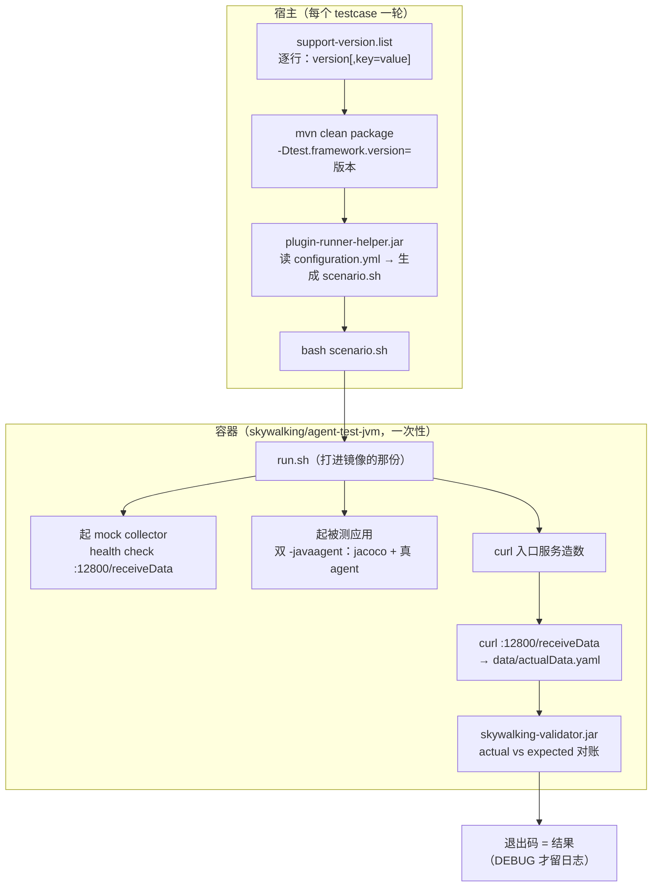

# 参考：上游 apache/skywalking-java 的 `test/plugin`

- **何时读**：想改本仓 `verify/` 的形态、拿不准某个设计是不是"上游也这么做"、或评估某个上游机制该不该借鉴时。
- **是什么**：对上游 [`test/plugin`](https://github.com/apache/skywalking-java/tree/main/test/plugin)（198 个场景、11 个 lane）的调研记录。**不是规范**，也不追上游版本 —— 上游随时在改。
- **本仓的位置**：`verify/README.md` 已声明形态借鉴自这里，并把「mock collector 端到端对账」与「Freemarker 配置生成 + tomcat-container 形态」划在不在范围。本文解释**为什么这么划**，并标出另外几条值得借鉴的。

> 本文所有结论都标了怎么核实的，路径见文末「怎么自己复核」。**第十一节列了我没读的部分**，别把它们当已验证结论用。

---

## 一、整体形状



**两层分工**：宿主负责"按版本把被测应用构建出来 + 生成跑法"，容器负责"跑 + 取数 + 对账"。

---

## 二、`containers/` 到底在干什么

这是最容易误解的部分：**它不是 CI 机制，是"一个 testcase 的完整运行时"**。

`containers/pom.xml` 的 `<name>` 写得很直白：**SkyWalking Plugin Test Runner Images**，只有两个 module：

| module | artifactId / name | 用途 |
| --- | --- | --- |
| `jvm-container` | `jvm-container` / **SkyWalking JVM Runner Image** | 被测应用是 fat-jar，由场景的 `bin/startup.sh` 用 `${agent_opts}` 启动 |
| `tomcat-container` | —（未细读） | 被测应用是 `*.war`，丢进 `/usr/local/tomcat/webapps/`，agent 靠容器里打过补丁的 `catalina.sh` 接进去 |

### 镜像里装了什么

构建方式是 `docker-maven-plugin`，**不是** `docker build`；触发点在 maven 的 `package` 阶段。

```xml
<name>skywalking/agent-test-jvm:${container_image_version}</name>
<from>${base_image_java}</from>
<workdir>/usr/local/skywalking/scenario</workdir>
<assembly><mode>dir</mode><targetDir>/usr/local/skywalking</targetDir>
          <descriptor>assembly.xml</descriptor></assembly>
<runCmds>
  <run>chmod +x /usr/local/skywalking/run.sh</run>
  <run>tar -xvf ../tools/skywalking-mock-collector.tar.gz -C ../tools</run>   <!-- ★ -->
  <run>apt-get update -y</run>
  <run>apt-get install -y unzip bash</run>
  <run>rm -rf /var/lib/apt/lists/*</run>
</runCmds>
<cmd>["/usr/local/skywalking/run.sh"]</cmd>
```

| 成分 | 作用 |
| --- | --- |
| `FROM ${base_image_java}` | JDK 版本由 CI lane 钉，场景矩阵不碰它（见第七节） |
| `run.sh`（`src/main/docker/run.sh`，4223 B） | **场景的执行体**，下面逐条 |
| `skywalking-mock-collector` | **agent 上报的落点**，断言数据的来源 |
| `unzip`、`bash` | 解场景 zip / 跑脚本 |

### 容器内 `run.sh` 的九个动作

按源码顺序，这是理解上游的关键一段：

| # | 动作 | 细节 |
| --- | --- | --- |
| 1 | 解场景 zip | `unzip -q ${SCENARIO_HOME}/*.zip -d /var/run/`，产物是宿主 `mvn package` 出来的 |
| 2 | 校验启动脚本在不在 | 不在就直接失败 |
| 3 | 起 mock collector | `collector-startup.sh &`，然后 health check `http://localhost:12800/receiveData` |
| 4 | 组装两个 `-javaagent` | `jacocoagent.jar`（`includes=org.apache.skywalking.*`，只插桩 agent 自己的类）+ 真 `skywalking-agent.jar` |
| 5 | 起被测应用 | `bash <场景>/bin/startup.sh &`，`${agent_opts}` 由场景自己填 |
| 6 | health check | 最多 `TIMES=60` 次 × `curl --max-time 3`，间隔 3s |
| 7 | 打入口请求造数 | `curl ${SCENARIO_EXTEND_ENTRY_HEADER} -s --max-time 3 ${SCENARIO_ENTRY_SERVICE}` |
| 8 | 取实际数据 | `curl :12800/receiveData > data/actualData.yaml` |
| 9 | 对账 | `java -jar skywalking-validator.jar`，退出码即结果 |

固定的 agent 参数（值得注意，说明这个运行时是**专为测试调过的**）：

```
-Dskywalking.collector.grpc_channel_check_interval=2
-Dskywalking.collector.heartbeat_period=2
-Dskywalking.collector.discovery_check_interval=2
-Dskywalking.collector.backend_service=localhost:19876
-Dskywalking.agent.service_name=${SCENARIO_NAME}
-Dskywalking.agent.authentication=test-token
-Dskywalking.meter.report_interval=1
-Xms256m -Xmx256m
```

`exitAndClean()`：默认删掉 `actualData.yaml` 与 logs；只有 `DEBUG_MODE` 才保留（并 `chmod -R a+r` 方便捞出来）。

### 为什么非得容器化

这张表是这节真正的价值 —— 换句话说，"能不能不用容器跑场景"：

| 需求 | 宿主 `java -jar` 为什么做不到 |
| --- | --- |
| mock collector 与被测应用**同网络** | agent 上报地址写死 `localhost:19876`，容器提供了这个隔离网络 |
| jacoco 插桩 agent 自己的类 | 必须在 agent 类被加载时插桩 |
| 每个 testcase 干净运行态 | 宿主只 `mvn package` 复用产物，运行态全新 |
| JDK / Tomcat 版本由 lane 统一钉 | 换场景不换运行时 |

---

## 三、宿主侧编排

入口 `test/plugin/run.sh`，一个 testcase 一轮：

| 步骤 | 做什么 |
| --- | --- |
| agent 准备 | `agent_home=../../skywalking-agent`，**不存在就 `mvn -Pagent -DskipTests clean package`** —— 用的是本仓库构建产物，不是下载的发行包 |
| 临时改 pom | 用 `sed` 把 `<sourceDirectory>scenarios/NAME</sourceDirectory>` 临时插进 `pom.xml`，跑完再删掉 |
| 构建容器镜像 | 仅 `--force_build` 时：把 `-Dbase_image_java` / `-Dbase_image_tomcat` / `-Dcontainer_image_version` 传给 `mvn package` |
| 逐版本循环 | 遍历 `support-version.list` 每一行 |
| 生成跑法 | `java -jar dist/plugin-runner-helper.jar -Dconfigure.file=configuration.yml -Dscenario.home=… -Dagent.dir=… -Djacoco.home=… -Ddocker.image.version=…` |
| 起容器 | `bash <work>/scenario.sh` —— **这个脚本是上一步生成的，不是手写的** |

`runner-helper` 的 resources 印证了"生成"这件事：

```
compose-start-script.template
container-start-script.template
docker-compose.template
scenario.sh
log4j2.xml
```

另有 `runningMode` / `withPlugins` 两个 `configuration.yml` 键：`agent_home_selector()` 会复制一份 agent，再把 `optional-plugins/` 或 `bootstrap-plugins/` 里点名的插件**挪进** `plugins/`。

CLI 选项：`-f/--force_build`、`--cleanup`、`--debug`、`--container_image_version`、`--base_image_java`、`--base_image_tomcat`。

---

## 四、场景文件集与 `configuration.yml`

一个场景目录（以 `hutool-http-5.x-scenario` 为例）：

```
hutool-http-5.x-scenario/
├── configuration.yml        # 4 个键
├── config/expectedData.yaml # 断言
├── pom.xml                  # 被测应用的构建（宿主上跑）
├── bin/startup.sh           # 启动脚本（负责填 ${agent_opts}）
├── support-version.list     # 支持的版本
└── src/
```

`configuration.yml` 全貌（**只有 4 个键**，版本不在这里）：

```yaml
type: jvm
entryService: http://localhost:8080/hutool-http-5.x-scenario/case/hutool-http-5.x-scenario
healthCheck: http://localhost:8080/hutool-http-5.x-scenario/case/healthCheck
startScript: ./bin/startup.sh
```

---

## 五、断言形态：`expectedData.yaml`

断言的是**agent 真实产出的 span 形状**，字段级。截自 `hutool-http-5.x-scenario/config/expectedData.yaml`：

```yaml
- serviceName: hutool-http-5.x-scenario
  segmentSize: ge 2
  segments:
    - segmentId: not null
      spans:
      - operationName: GET:/hutool-http-5.x-scenario/case/hutool
        parentSpanId: -1
        spanId: 0
        spanLayer: Http
        startTime: nq 0
        componentId: 1
        isError: false
        spanType: Entry
        peer: ''
        tags:
        - {key: url, value: 'http://localhost:8080/…/case/hutool'}
        - {key: http.method, value: GET}
        - {key: http.status_code, value: '200'}
        refs:
        - {parentEndpoint: GET:/…/case/hutool-http-5.x-scenario, refType: CrossProcess,
           parentSpanId: 1, parentTraceSegmentId: not null, parentService: hutool-http-5.x-scenario,
           traceId: not null}
```

值得注意的表达手法 —— **用比较运算符而不是精确值**，所以断言对时间抖动不敏感：

| 写法 | 含义 |
| --- | --- |
| `segmentSize: ge 2` | 至少 2 个链路段 |
| `segmentId: not null` / `traceId: not null` | 存在性 |
| `startTime: nq 0` | not greater than 0（时间戳量纲） |
| `skipAnalysis: 'false'` | 分析标记 |

**`refs` 是跨进程传播的证据**，RPC 类场景必须断言它 —— 上游 CLAUDE.md 说得很直接：*"A scenario that asserts spans but not the ref does not prove propagation."*

---

## 六、`support-version.list` 的选版规则 —— 最值得借鉴的一条

上游 CLAUDE.md 原文：

> `support-version.list` must cover the framework's supported range, but keep **one version per minor version — the latest patch**, not every patch.

`hutool-http-5.x-scenario/support-version.list` 的注释把同一句话又说了一遍：

```
# ... Contains only the last version number of each minor version.
5.0.7
5.1.5
5.2.5
5.3.10
5.4.7
5.5.9
5.6.7
5.7.22
5.8.3
```

`httpclient-4.3.x-scenario/support-version.list`（没有那行注释，但实际也是一个 minor 一个）：

```
4.5.4
4.4.1
4.3.6
```

### 与本仓的实测对比

| 库 | 上游选了 | 本仓选了 | 差距 |
| --- | --- | --- | --- |
| **hutool 5.x** | 9 个版本，**跨 5.0 ~ 5.8 全部 minor** | `5.4.1`、`5.8.47` | 5.0~5.3、5.5~5.7 完全没验 |
| **httpclient 4.x** | `4.3.6` / `4.4.1` / `4.5.4`（3 个 minor） | `4.5.13`、`4.5.14` | **同 minor 的两个 patch** |

**本仓 httpclient 那条明确违反上游规则**。理由是 agent 插件真正要验的是 **minor 级的 API 兼容**（某个 minor 里被增强的方法签名/调用形态是否稳定），而不是 patch 级 —— 同 minor 的 `4.5.13` 与 `4.5.14` 对插件几乎没有区别。

代价要说清：按上游口径补齐后，本仓 CI 的 verify job 数会从当前 5 个涨到十几个，墙钟不变（job 并行），但 **m2 缓存并发恢复次数**与 **flake 面**会涨。

### 上游还有一种本仓表达不了的格式

```
# 格式：version[,key=value[,key=value...]]
# 例：2.7.14,spring.boot.version=2.7.19
```

即**每个版本可以挂不同的 maven 属性**。本仓是**场景级单值**（`scenario.conf` 的 `MATRIX_PROPERTY="hutool.version"`），所有版本共用一个属性名。若某个场景需要按版本切不同坐标（例如 hutool 5.0 与 5.8 的 json 库坐标不同），本仓现在的机制表达不了。

---

## 七、版本钉在 CI lane，不在 `configuration.yml`

这是上游一条容易漏读的设计：`configuration.yml` 只说 `type: tomcat`，**不选 Tomcat 版本**。

- 具体 JDK / Tomcat 版本来自 lane 的 `Build` job 传给 `.github/actions/build` 的 `base_image_java` / `base_image_tomcat`，**同 lane 的所有场景共享这一个镜像**。
- 后果：`type: tomcat` 在 `plugins-jdk8-*` lane → `tomcat:8.5-jdk8`（javax）；`jdk11` → `tomcat:9.0-jdk11`（javax）；`jdk17` → `tomcat:10.1-jdk17`（**jakarta**）。
- 所以 jakarta 系框架（Struts 7、Jetty 12、Spring 6）**必须**注册到 JDK-17 lane —— 把 jakarta WAR 放到 Tomcat 8.5 lane 上根本部署不了。
- 场景按负载分摊到多个 lane 文件；CLAUDE.md 说用 `python3 tools/select-group.py` 挑最闲的 bucket。

**一个观察到的出入**：按 `*plugin*` 过滤 `main` 上的 `.github/workflows/`，实测到 11 个 lane 文件（`plugins-jdk11/17/21/25-test.<n>.yaml`、`plugins-test.0~3.yaml`、`plugins-tomcat9/10-test.0.yaml`），**没见到 `jdk8` 的 lane**，而 CLAUDE.md 里仍在讲 `plugins-jdk8-*`。两者对不上，可能是 lane 已调整而文档滞后。**别依赖这条细节。**

---

## 八、CLAUDE.md 里的三条判断标准

上游把"什么算测到了"写成了规范（`test/plugin/CLAUDE.md`）。这三条**机制上本仓没有，但判断上适用**：

| 判断 | 原文要点 |
| --- | --- |
| **场景是主要且充分的测试** | 别为插件堆 mock 单测。真实风险只有两处 —— 拦截器把参数转成框架类型后能不能读到字段（mock 验不了）、以及跨版本兼容 —— 而场景一次就把两件都验了。单测留给真正逻辑/命名空间关键的**共享**代码 |
| **断言完整 span 形状，别只断言一个 entry** | RPC / web 类要驱动完整往返（2 entry + 1 exit），**并且必须断言 `refs`**；客户端类（JDBC / Redis / HTTP client / MQ producer）对端不是被观测的服务，**没有第二个 entry span**，只需断言 exit span，不要为它搭另一个服务 |
| **一个 minor 一个最新 patch** | 见第六节 |

第二条对本仓有直接解释力：**`verify/` 的 override 场景为什么要一并装载 `logfile-reporter`？** 上游的答案就是这个 —— 客户端型插件自己不出数据，需要一个"读口"。本仓的读口就是 `logfile-reporter`（`verify/README.md` 写的是"override 插件自身不提供数据读口"），**但没写出这个上游依据**。

---

## 九、本仓已有的关系，与明确不借鉴的四项

`verify/README.md` 现在的「不在范围」是两条，加上本文调研后我认为仍然是四条：

| 上游做法 | 不借鉴的理由 |
| --- | --- |
| mock collector 端到端对账 | logfile-reporter 的存在意义就是 **OAP-less**，数据不出进程。容器的价值在"agent 上报 → collector → expectedData.yaml"这条通路上，而本仓**刻意没有这条通路**。HTTP 读口 + `checks.sh` 更轻 |
| `type: tomcat` WAR 形态 | 本仓被测应用是 Spring Boot fat-jar，与上游 `type: jvm` 同形；没有插件需要 WAR |
| Freemarker 配置生成 + archetype | 3 个场景手写 `scenario.conf` 更直白，规模差两个数量级 |
| 11 个 lane 文件分摊 | 198 个场景才需要；本仓 5 个 job，单文件够 |

**另一个形态差异，值得记一笔**：上游的 agent 是**仓库构建产物**（`mvn -Pagent package`，所以能测刚改的 agent）；本仓是**下载 9.4.0 发行包**（`verify/Dockerfile` 里 curl 官方 tgz），再把本仓的 override 插件装进去。两者各有道理 —— 本仓这样验的是"插件对**已发布** agent 的兼容性"，但代价是**本仓改不到 agent 本体时无法验证 agent 侧改动**。

---

## 十、一个待核实项

`verify/scenarios/override-httpclient/scenario.conf` 里：

```
# 官方 httpClient 4.x 插件与本 override 版同源类被同一 agent 同时增强,故移除避免重复增强
REMOVE_OFFICIAL_PLUGINS="apm-httpClient-4.x-plugin-*.jar"
```

但**本机 9.4.0 发行包的 `plugins/` 里只有 `apm-httpclient-3.x` 和 `apm-httpclient-5.x`，没有 4.x**（`override-*` 两个 jar 是本仓自己的，已装进去）。而上游 `main` 存在 `httpclient-4.3.x-scenario` 与 `hutool-http-5.x-scenario`，说明官方 4.x / hutool 插件在上游是有的。

`run-scenario.sh` 用了 `nullglob`，所以这行目前是**安全的 no-op**。但有两种可能，结论不同：

1. 9.4.0 发行包真的不含官方 4.x 插件 → 这行是死配置，注释描述的"重复增强"不会发生；
2. 本地 agent 装得不全（`setup.ps1` 装过）→ 配置是对的，只是本机看不到。

**没验证。** 动这行之前先查清。

---

## 十一、我没读的

下面这些**没有读过**，本文对它们只有 CLAUDE.md 的转述，不要当实测结论：

- `runner-helper` 的 **Java 源码** —— 已知 `configuration.yml` → `scenario.sh` 是它生成的，但生成规则、`docker-compose.template` 何时用，都没读。
- `containers/*/src/main/docker/assembly.xml` 全文 —— 只从 `pom.xml` 的引用知道它组装 `run.sh`，内容没看。
- `containers/tomcat-container/` —— 整节内容全部来自 CLAUDE.md 的描述，**没读它的 pom 或 run.sh**。
- `apm-sniffer/apm-sdk-plugin/CLAUDE.md` 的 **"Plugin Test Framework"** 一节 —— 上游 CLAUDE.md 明确把框架机制指向那里，我没跟过去。
- `docs/…/Plugin-test.md` —— 同上。
- `test/plugin/pom.xml`、`generator.sh`、`script/`、`agent-test-tools/`、`archetypes/`。
- 各 lane 的 workflow 文件内容（只数了文件名）。

---

## 怎么自己复核

| 想核什么 | 怎么看 |
| --- | --- |
| 目录结构、文件清单 | `GET https://api.github.com/repos/apache/skywalking-java/contents/<path>` |
| 任何单个文件 | `https://raw.githubusercontent.com/apache/skywalking-java/main/test/plugin/<path>` |
| 判断标准原文 | `test/plugin/CLAUDE.md` |
| 版本列表 | `test/plugin/scenarios/<场景>/support-version.list` |
| 本机 agent 有哪些插件 | `<agent>/plugins/`（默认 `D:\apps\apache-skywalking-java-agent-9.4.0\plugins\`） |

上游 `main` 随时会变。**上面带具体版本号的数字（198 场景、11 lane、9 个 hutool 版本等）只对调研当时成立**，用前先重取。
